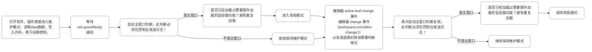
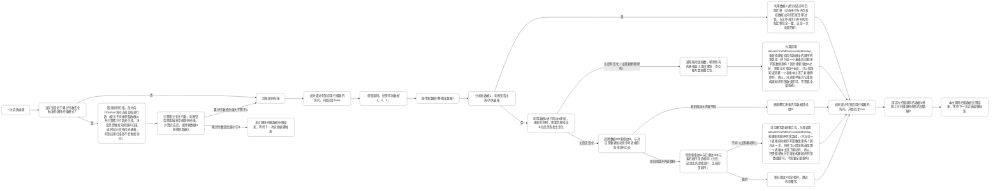
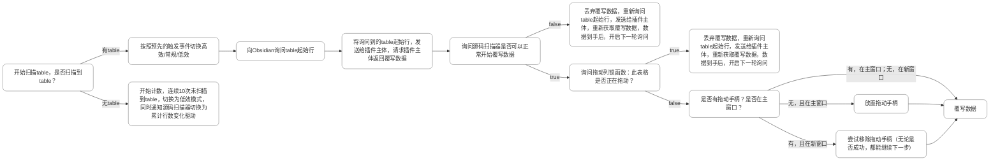
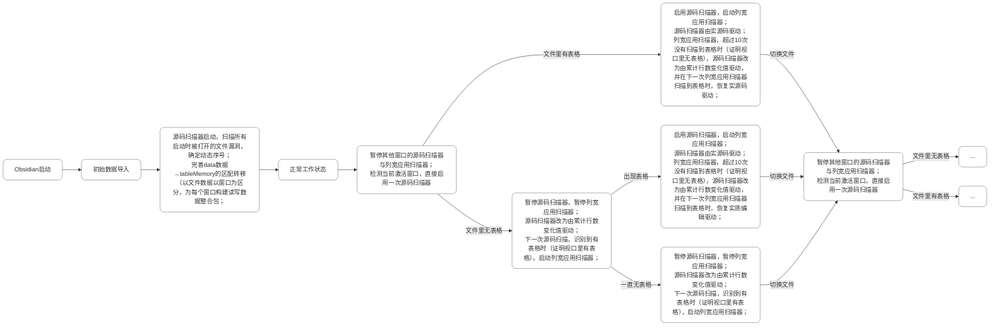
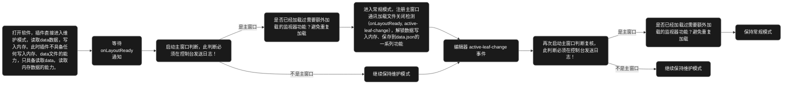

## 数据结构
我们正在制作/完善一个Obsidian插件，目的是控制文档内表格的列宽。
我们现在data数据文件的结构是这样的：
```
 【数据结构】
 磁盘数据 (data.json):
 settings.columnWidths: {
	[filePath]: {
       [tableIndex: string]: {
         fingerprintB: string[],   // 排序后的完整标题数组 (不去重，null 表示空标题，使用完整标题不截断)
         colWidths: number[],      // 顺序列宽数组 (1 代表自适应)
         widths: {                 // 标题 => 列宽数组 (处理同名标题/空标题)
           [title | "null"]: number[]
         }
       }
     }
}
```

数据结构按照文件分组，按照文件分组后，文件内按照**表格序号**分组。做到一个文件内全部表格数据在一个大块，而这个文档内的文档数据，又有自己的一个小块，小块内存储三样东西：指纹B、顺序列宽数组、标题 = [列宽1，列宽2，……]数组
    指纹B：[标题1，标题2，……]，这是一个**排序过**的（不去重），由标题组成的数组，空标题用null占位
    顺序列宽数组：[列宽1，列宽2，……]，这是将表格列宽，从左到右记录成的数组，方便快速应用
    标题 = [列宽1，列宽2，……]数组：表格中每个标题对应的宽度数据，专门为了解决同名标题列以及空标题列宽度问题设立。

## 表格序号
首先说明，什么是表格序号，表格序号有什么用

当**表格数量变化时，触发扫描**，取出文档中每一行**前3个字符**，如果为“| :”、“|:-”、“| -”、“|--”，则标记为分隔行，说明这里有一个表格，记录此行号为表格行号。 如果为“> |”，需要重取这一行，取前**6个字符**如果为“> | :-”、“> |:--”、“> | --”、“> |---”，也标记为分隔行。 

有几个分隔行，此文档中就有几个表格，比对表格行号，就可以确定表格序号。 需要应用列宽时，从上到下应用时，第一个表格就用序号1取data数据，第二个就用序号2取data数据，以此类推。（**行号不于表格序号绑定**，只用于比对确定表格序号，辨认一个表格，**用的永远都是指纹**。确定后，行号就没用了。下一次触发扫描，需要重新获全新的表格行号对比确认表格序号）

**文档内的表格数量，必须只通过原先的扫描源码方式途径获得，不可通过其他任何途径间接获得！**（比如通过软件dom元素数量获得，因为可能存在文档渲染不完全的情况，但是从源码扫描获取文档数量，绝对不会出错！）

同理，文件内是否真的有表格，也是扫描源码判断！别因为渲染延迟，扫描不到dom就判断文件内无表格，从而造成列宽应用失败、错误！

打开一个文档时，扫描源码的时候，应该触发一次数据补全！！

比如我的“章纲 5 1”里，明确有8个表格，这是一个别处导入的文档。文档打开（实时预览模式）之后， data里必须立刻生成8个表格数据块！这8个数据，是打开文档后，插件首先尝试读取data文件，应用列宽，随后发现此文档没数据，是第一次打开，接着扫描源码，为所有表格按照序号创建数据块（内存里也同时加载，此时内存里数据立刻变为权威的，因为跳过了一开始的列宽应用环节）。 之所以必须有8块数据，是为了后续编辑表格时，数据储存不出错，以及下次打开文档，列宽数据的正确读取应用和动态序号、静态序号的对应。
**文档内的表格数量，必须只通过原先的扫描源码方式途径获得，不可通过其他任何途径间接获得！**（比如通过软件dom元素数量获得，因为可能存在文档渲染不完全的情况，但是从源码扫描获取文档数量，绝对不会出错！）
同时需要注意，这个触发，只有data里没有相应序号数据的时候才会触发，否则是不会触发的，或者data里数据数量和实际表格对不上，触发后，只补全确实序号的表格数据，不会重置之前已有的表格数据。
（此时构建默认数据块，默认列宽就直接填入列宽“1”，无论有没有开启自适应。列宽“1”的后续替换，交给插件主体计算的时候替换，初始化不需要管那些东西。且默认初始化，新窗口中也需要执行。不需要进行任何判断，没有数据，就直接初始化。 必须做到，只要文件中有表格，打开这个文件，data里就必须有对应数量的数据，无论在哪里打开，都是这样。）


但关键问题还是：渲染后的表格DOM元素，如何知道自己是"第几个表格"？ 我们应用时DOM元素出现的前后顺序，就是表格序号。第一个出现的，对应序号1，第二个出现的，对应序号2，一次类推。 我们之所以用分隔行判断表格序号，并用表格序号分块记忆表格宽度数据，就是为了始终让data里的数据，按照DOM元素中表格出现的顺序排列，这样我们遇到第几个DOM元素，就可以直接用相应序号去data里取数据。 为什么不直接使用行号代替表格？ 使用分隔行排序表格并给表格手动编序号，这样无论表格中间如何插入内容，扫描后，分隔行的先后顺序总是不变的，也就是表格序号始终是固定的。 

如果突然出现一个表格，或者减少一个表格，导致全部表格序号都错误了，怎么处理？ 比如表格A=1，表格B=2，表格C=3。突然删除了表格A，就会导致B=1，C=2。 但是原先data里，序号1的数据是表格A的，序号2的数据是表格B的，序号3的数据是表格C的。此时如果因为B=1，去取回data里序号1的数据，其实就是取回了表格A的宽度数据。这肯定会导致错误，因为表格A的数据肯定无法直接用于表格B。 但是我们可以完全不用管这个情况，这个情况有方案解决。

## 序号错位如何应对？

我们现在已经可以按序号存储、调用data数据了，但是：
我们之前说过，比如表格A=1，表格B=2，表格C=3。突然删除了表格A，就会导致B=1，C=2。如果出现这种表格序号错位的情况，必定会有很多因为短指纹C对不上而无法应用的情况。

所以我们还需要**区分文档内序号于data数据内序号**！在每次应用宽度数据时，增加一个序号纠察步骤：

针对上面的情况，我们打开文档时可以得到：
    当前文档中：表格B=文档内序号1，表格C=文档内序号2
    data数据文件中：表格A=data数据内序号1，表格B=data数据内序号2，表格C=data数据内序号3

须知，我们一直使用序号指代表格，只是为了应用宽度数据的时候更快。但是，一个表格之所以能区分其他表格，**根本原因**还是因为指纹的不同。

所以，我们这里直接用上述例子里说到的情况说明：
我们直接扫描分隔行，定位表格，定位标题行，取得每个表格的标题行内容，转化为指纹B。
再对每个表格的指纹B做处理，剔除指纹B中空标题行占位符，得到一个有切实内容的短指纹C。（短指纹C不去重。如果一个指纹B里面全都是null，那指纹C=指纹B）。

这样，我们可取得文档内现有表格的短指纹C，令各自的短指纹C=文档内序号，data里的数据也同样处理，得到：
如果文档中有表格B，表格C：
    表格B=表格B的短指纹C=[表格B标题1，表格B标题2，……]=文档内序号1，
    表格C=表格C的短指纹C=[表格C标题1，表格C标题2，……]=文档内序号2，

data数据文件中：
    表格A=表格A的短指纹C=[表格A标题1，表格A标题2，……]=data数据内序号1，
    表格B=表格B的短指纹C=[表格B标题1，表格B标题2，……]=data数据内序号2，
    表格C=表格C的短指纹C=[表格C标题1，表格C标题2，……]=data数据内序号3，

再进一步处理data数据文件中的短指纹，组成一个数组：
    [ [表格A标题1，表格A标题2，……]，[表格B标题1，表格B标题2，……]，[表格C标题1，表格C标题2，……] ]，可知，在这个数组中，每个元素代表一个表格短指纹C，而每个数据在数组里的位置，就是对应表格的data数据内序号。

所以，我们使用当前文档中表格的短指纹C：
    表格B=表格B的短指纹C=[表格B标题1，表格B标题2，……]=文档内序号1，
    表格B=表格C的短指纹C=[表格C标题1，表格C标题2，……]=文档内序号2，

在[ [表格A标题1，表格A标题2，……]，[表格B标题1，表格B标题2，……]，[表格C标题1，表格C标题2，……] ]进行匹配，发现，[表格B标题1，表格B标题2，……]，位置在2，[表格C标题1，表格C标题2，……]位置在3。所以，实际上当前文档内的正确宽度数据对应结果是：
    表格B=表格B的短指纹C=文档内序号1=data数据内序号2，
    表格C=表格C的短指纹C=文档内序号2=data数据内序号3，

所以，当前文档中
    文档内序号1的表格，应该用序号2从data里取出数据
    文档内序号2的表格，应该用序号3从data里取出数据

现在数据取出正确，就可以按照正确步骤应用数据了。

如果在这种情况下，依旧有无法对应处理的表格，比如一个表格的短指纹，在data数据中短指纹构成的数组中查询不到。我们放任表格宽度自适应即可。（也不是不可以解决，但是暂时没必要解决，放任自适应即可）


## 表格序号增加如何应对？

我们上一步已经解决了序号错位的应对方式，现在，我们可以自由删除任意表格，而不损失列宽数据。
而对于一个新建表格，由于表格全空，所以直接放任列宽自适应即可。

但是，如果总序号是增加呢？或者先减，后增呢？
比如，一个表格被剪切调整了位置。
那么，我们是否可以通过延迟释放内存里文档数据，做到几分钟内，做到新表格出现时，如果新表格指纹B非空，直接在之前的数据里遍历匹配短指纹，如果匹配到，就应用已有列宽，没有匹配到，再让列宽自适应？

### 孤儿池
设计一个孤儿池区域。关于孤儿池区域，放入什么数据？

还是拿上面那个错位的例子说明：
    表格B=表格B的短指纹C=文档内序号1=data数据内序号2，
    表格C=表格C的短指纹C=文档内序号2=data数据内序号3，

我们发现，每一次序号错位，比对确定表格顺序列宽数组时，总会有一个序号多余。**表格减少几个，就会多出几个待放入的孤儿数据**，这个数据就可以放入孤儿池，用于对后续新出现的短指纹C非空的表格进行匹配，如果匹配上，就直接应用孤儿池里的标题=列宽数组。

如果此时，又删除一个表格，导致序号错位。我们之前说了，表格减少几个，就会多出几个多余的孤儿数据。所以此时，又出现一个孤儿数据。如何确定这个孤儿数据，需不需要放入孤儿池？

我们可以用一个特殊的数据结构，会自动排除重复值的数据结构，直接往里面放就行。

孤儿池解决了一个表格消失又重新出现的问题。那，


**如果是一个表格被复制，导致表格总数量增加呢？**


首先，被复制的表格也是新出现的表格。会去孤儿池里找数据，但是没找到。所以使用自适应列宽。但是我们只需要让其和孤儿池匹配之后，如果没有结果，就和权威数据匹配，就可以找到列宽数据了！

为什么可行？
我们之前说过：
> 所以，我们使用当前文档中表格的短指纹C：
>     表格B=表格B的短指纹C=[表格B标题1，表格B标题2，……]=文档内序号1，
>     表格B=表格C的短指纹C=[表格C标题1，表格C标题2，……]=文档内序号2，
> 
> 在[ [表格A标题1，表格A标题2，……]，[表格B标题1，表格B标题2，……]，[表格C标题1，表格C标题2，……] ]进行匹配，发现，[表格B标题1，表格B标题2，……]，位置在2，[表格C标题1，表格C标题2，……]位置在3。所以，实际上当前文档内的正确据对应结果是：
>     表格B=表格B的短指纹C=文档内序号1=data数据内序号2，
>     表格C=表格C的短指纹C=文档内序号2=data数据内序号3，
> 
> 所以，当前文档中
>     文档内序号1的表格，应该用序号2从data里取出数据
>     文档内序号2的表格，应该用序号3从data里取出数据

所以，当一个复制的表格出现，比如表格C被复制了，使用这个新出现表格短指纹C，去和权威数据匹配，自然还是会返回位置在3，所以同样可以得到：
    复制表格短指纹=表格C的短指纹C=data数据内序号3

可见，一个表格即便没有序号，也可以确定自己在权威数据中对应数据块的编号！这正是我们说的：
> 须知，我们一直使用序号指代表格，只是为了应用宽度数据的时候更快。但是，一个表格之所以能区分其他表格，**根本原因**还是因为指纹的不同。

**所以，权威数据并不会因为被重复匹配就被占用导致后续无法再次用于匹配！**


## 总体思路再简述

当文件**打开时**，data文件里的数据是权威的、静态的，后续我们扫描文档里的表格，在**内存里**生成动态数据，比对使用列宽，应用完列宽后，动态数据权威化，变为权威的。

当文档**编辑时**，**data文件里的数据没有任何用**，**所有的数据操作全在内存里，永远不会用到硬盘里的数据**。当出现新建表格，删除表格时，立刻**将前一刻的动态数据划分权威的（相当于打开文件时读取的静态数据）**，重新扫描文档，创建最新的动态数据，并在内存里进行指纹B比对，完成数据迁移、纠正，将最新的动态数据重新权威化。所以编辑文档时，应用列宽，数据调整完全在内存里，速度应该会非常快，而且也避免了频繁读取data文件，做到只在打开的时候，读取一次data文件。
    **也就是说，一次数据写入，最小单位是一表格数据的覆盖，永远不会是追加数据，只会是覆盖数据！一旦触发数据写入，就是以表格数据为最小单位的覆盖，不存在其他类型的数据写入表现**

随后1s防抖计时器结束，将内存里现用的权威动态数据，直接完整覆盖data文件里对应的文件数据或表格对应的一整块数据，这样就可以避免软件突然关闭，也能最大限度保存内存里的权威数据。

总体上，**尤其需要注意动态数据的权威、非权威身份转变逻辑**。

## 顺序列宽数组的作用

顺序列宽数组的作用很重要：

- 打开文档时，短指纹C比对通过后，判断表格为同一个表格，快速应用列宽。此时直接使用`colWidths` 数组即可，不需要再重新映射构建`colWidths`；
- 编辑文档时，编辑标题行时，由于标题会实时变动，停止构建指纹B，只使用顺序列宽数组维持表格列宽，保证编辑时表格列宽不因为标题变动而失控，为编辑结束后，**正确构建表格指纹B提供跳板**。
  - 编辑标题和拖动列宽不会同时发生，所以编辑标题时，直接用顺序宽度数组维持表格宽度即可。并在编辑时，实时更新**内存里的**指纹B，**内存里的**标题=列宽数组，为后续写入data做准备；
  - 关于新建列，删除列时，这个表格必须从内存里的标题=列宽数组里按照标题取回列宽数据，**生成新的顺序宽度数组应用**。而不能单纯的应用内存中已有的顺序宽度数组，导致列宽数据混乱。
- 当我们删除一列的时候，由于总数没变，表格表格序号也没变，所以此时表格还是那个表格。应该触发重新生成顺序宽度数组，然后应用。而不是将所有其他列都重置为自适应宽度。


## 注意事项

- 我们完全禁止阅读模式拖动调整列宽，并且在阅读模式时，完全不进行任何内存数据的修改。仅用内存数据修改阅读模式下的列宽进行展示作用。**这一点必须严格遵循！**
- 拖拽表格时，在拖拽过程中直接记录最终宽度，确定需要保存到data里的宽度数值，无需依赖 DOM 属性等间接获取。
- **源码扫描不到表格时，若内存中仍存有该文件的数据，必须保留内存，绝不可同步空数据到磁盘**。因为扫描可能因时序问题失败，不能轻易丢弃已有数据。而且，按照我们的设计逻辑，只要文件里表格，data里就一定会有数据的。
- 我们插件对于列宽的应用方式，是出现一个dom，就应用一个列宽。不是开始应用一批就停止检测应用，不会出现dom存在但列宽未应用的情况。

### 代码审查常见误区（重要）

1. **误区一：结构变化时 `setupTableResize` 会错误重建 `colWidths`**
	- **错误推理**：`processEditorTables` 在 `structureChanged = true` 时会调用 `matchAndMigrateTablesForFile`，迁移完成后传入 `allowFingerprintUpdate = structureChanged`（即 `true`）调用 `setupTableResize`，内部会进入重建 `colWidths` 的分支，从而覆盖刚迁移来的权威列宽。
	- **实际代码路径**：`matchAndMigrateTablesForFile` 执行后，`tableMemory` 中的 `colWidths` 已经与当前表格列数对齐（截断或补 1）。进入 `setupTableResize` 后：
	  - 若列数未变 → `colCountMismatch = false`，仅更新指纹（`fingerprintChanged && !colCountMismatch`），**不会触发重建**。
	  - 若列数变化 → `colCountMismatch = true`，此时**必须**通过 `widths` 映射重建 `colWidths`，这正是正确行为。
	- **结论**：代码逻辑保护了迁移结果，不会发生无意义的覆盖。审查时务必注意分支条件的互斥性。

2. **误区二：DOM 未完全渲染时会污染内存数据**
	- **错误推理**：当 DOM 表格数量与源码分隔行数量不一致时，对已出现表格计算短指纹C并匹配 `findMemoryIndexByFingerprint`，随后调用 `setupTableResize` 更新该序号对应的内存数据，可能因为序号映射尚未建立而覆盖错误槽位。
	- **实际代码路径**：在进入不完全渲染分支之前，**如果** `structureChanged = true`，`matchAndMigrateTablesForFile` **已经先执行**，此时内存映射已是完全正确的（文档内序号与数据序号对应）。后续 `findMemoryIndexByFingerprint` 返回的 `foundIndex` 正是该表格应有的数据序号，更新是正常维护。如果 `structureChanged = false`，则说明内存映射本就有效，序号未变，更新也不会错位。
	- **结论**：只要内存中的序号→数据映射是有效的（通过结构变化时的匹配迁移保证），不完全渲染期间的写入就是安全的。审查时切忌忽略代码执行顺序。

**误区根源总结**：审查时容易孤立地看某一个函数内部，而忽略了调用前整体的数据准备（如匹配迁移）和分支条件的精确约束。务必从整个数据流的时间线去推演，方能避免此类误判。


## 已有功能


### 自适应铺满
现在我希望在插件设置里，加入一个功能：
自适应铺满：启用自适应铺满之后，空白列的宽度固定当做100px处理，这样，所有的列都变的有确定的起步宽度值（但是data储存下来的数据依旧是1，方便后续取消模式时，依旧保留自适应；注意，这个100px不代表后续空标题的列宽不可以拖动设置自定义列宽，只是如果一个列，处于没有设置宽度的状态，就默认给100px的意思），并且，如果当前表格的显示总宽度小于编辑区是，让最右侧的列铺满编辑区剩下区域。

因为这个变动较大，还需要注意，**对编辑标题行时的列宽保持逻辑**，不要因为编辑后，标题行无内容而被识别为新单元格，从而触发重置列宽为100px操作。

注意，这个铺满是自适应的，是变化的！
最右侧的列铺满编辑区，不是一次性的计算出最右侧的列宽，然后就不用管了。而是每一次调整表格列宽都都会检查，如果调整列宽后，表格总宽度小于编辑区，就会再次触发自适应铺满，自动将剩余的显示宽度分给最右侧的列以实现自适应铺满。

编辑区宽度是： `<div class="cm-sizer">……</div>`的宽度。

那此时最右侧的列，还需要记录自己的宽度数据吗？
需要，当然需要。这是为了辅助我们判断是否需要触发自适应铺满。

我们这里拿一个默认创建的两列表格说明：

|     |     |
| --- | --- |
|     |     |
这个表格，刚创建的时候，因为我们开启了自适应列宽，所以空白列的宽度固定为100px了。此时每列宽度相同，此时表格在data里存储的列宽数组为[100，100]（**顺序储存列宽数组，data里的顺序列宽数组，内存里将要储存到data里的顺序列宽数组**），此时，假设插件查询到编辑区宽度为932，表格总宽为100+100=200，小于编辑区宽度，触发自适应铺满，直接将932-200=732的剩余可显示宽度分配给最右侧的列，使其显示列宽为100+732=832，于是，当前表格的显示列宽数组应为[100，832]（**顺序显示列宽数组，实际显示出的列宽**）。很显然，data里的数据和实际显示出的列宽不一致，这正是因为我们开启了自适应铺满，所以最右侧的那一列获取了特权，可以超宽显示，占据编辑区剩下的宽度。

如果此时拖动最右侧的列，比如让其宽度变为比如说1000，此时data里数据也发生了改变，储存列宽从[100，100]变为[100，1000]。那此时插件如何决定应用列宽呢？

依旧用表格总宽度和编辑区宽度判断。因为100+100=1100，大于编辑区宽度932，所以此时**不触发自适应铺满**，直接应用储存列宽数组即可，**表格自然溢出编辑区**。

如果后续又拖动最右侧列，改变它的宽度，使得列宽变为300，此时表格储存列宽数组变为[100，300]，100+300=400，小于编辑区总宽度932，**触发自适应列宽铺满**，将932-400=532的宽度补给最右侧的列，此时data文件里，表格储存宽度为[100，300]，但是应用的时候，顺序列宽数组变为[100，832]，表格铺满编辑区。

对比理解可以发现，自适应列宽逻辑自洽，完全不会导致矛盾。我们只需要在应用列宽前，查询到当前表格的储存列宽（打开文档时读取data文件里的，编辑文档时读取内存里的，正如我所说的，编辑文档时涉及到的全部数据操作，都在内存里进行），计算表格总宽度，和编辑区宽度对比，即可确定需不需要触发自适应铺满，以及最终应用的显示列宽数组值。

其实这会造成一个隐藏的问题，但是考虑到自适应铺满的便利，所以我们不管。
这个隐藏问题是啥？比如上方的例子中，表格储存宽度为[100，300]，但是应用的时候，顺序列宽数组变为[100，832]，此时我们拖动减小最右侧列的列宽，因为表格是自适应铺满的，所以拖动右侧列的宽度是从832开始减的，即，拖动的瞬间，最右侧列的储存宽度不是从300开始减少，而是瞬间变为832，然后从832开始减少。但是无论从哪里减少，拖动结束后比如顺序储存列宽数组变为[100，700]，都会因为100+700=800，小于编辑区宽度932而再次触发自适应铺满。

那表格顺序储存列宽数组和大于编辑区宽度时怎么处理？
比如：顺序储存列宽数组为为[100,200,156,300,200]，和为953，大于编辑区宽度932。
其实没有啥需要特殊处理的，953大于932，所以不触发自适应铺满，直接应用储存顺序列宽数据即可。

综上，我们通过令所有原先宽度为1的列的列宽固定为100px，从而获得了准确判断是否需要触发自适应列宽的能力。

### cssclasses=0
1. 在cssclasses中指定样式“0”，在相应文档中**完全**禁用插件。

### cssclasses=1
支持在自适应铺满关闭时，使用cssclasses中添加“1”，单独为此文档开启自适应铺满，此时：
cssclasses中有“0”的逻辑不变，依旧是插件完全不起作用（但是需要检测元数据区域，因为随时可能取消“0”状态），只有在cssclasses中同时有“0”和“1”时，为了“1”，我们允许临时降级，从完全不起作用，变为仅禁止拖动。
总结：
无论自适应是开启还是关闭，只要cssclasses中有“0”，且只有“0”，插件对此文档完全不起作用。
无论自适应是开启还是关闭：只要cssclasses中有“1”，就为此文档启用宽度自适应；如果此时cssclasses还有“0”，则“0”模式降级为仅禁止拖动调整列宽（为防止手柄移除不及时，此时就算拖动了列宽，也不在储存，因为启用了“0”模式），列宽依旧正常应用，且为自适应。
至于自适应开启，同时cssclasses中还有“1”，这也没啥事，毕竟本来就是自适应。

### 自适应铺满优化 1

插件好像在切换文件再切换回来的时候，都会重新计算一次自适应铺满补偿量？
所以列宽不能立刻应用，因为有个计算过程卡住了。
所以表格列宽会在切换回来的时候，会有一个最右侧列宽度瞬间变大的过程。


所以我们需要优化一下显示列宽应用逻辑，我们直接禁止切换文件时的自适应补偿计算（避免切换文件导致的编辑区宽度丢失造成的显示数据重置），不计算，并在任何时候，都是应用旧显示列宽，在下一次切换回文件，产生实际编辑行为时计算，计算后，比对新计算列宽数据和旧列宽数据，如果相同跳过应用，避免重构。如果不同，则再重新应用。

这样，无论如何，都一定程度上可以减缓计算导致的瞬间宽度变化！

同时需要注意，异步计算如果因为快速切换视图导致中断，则直接放弃，继续使用旧数据。没有计算完的废数据，直接丢弃。

### 自适应铺满优化 2
一个已经打开的文档，因为暂时切换到别的文档，随后切换回来，因为部分表格dom在切换过程中丢失，所以dom中表格数量不等于源码扫描（或者data文件里）表格数量，可能会导致插件以为这是第一次打开文件，需要重新计算自适应铺满补偿量，无法直接应用对应的旧显示列宽。

我们需要解决这个问题，我们可以参考未设置自适应铺满时列宽应用的逻辑：
	未开启自适应铺满的文档，其中的表格，是直接匹配读取权威数据，用短指纹C匹配表格序号，取回对应列宽数据进行应用的。所以无论dom中表格是否完全渲染，我们都能准确应用表格数据，且非常快。

我们为开启了自适应铺满的文档，单独建立一个显示权威数据库，用于储存计算好的显示列宽。
	显示权威数据库中：短指纹C=顺序显示列宽的数组。
	除此之外，还需要专门储存计算时使用的编辑区宽度数据！

**注意，显示权威数据库是仅存在于内存里的！实际的data文件结构依旧没变！**

当我们打开一个开启了自适应铺满的文档时，额外为此文档建立一个显示权威数据库，当应用表格列宽数据时，优先从显示权威数据库里用短指纹C匹配列宽，匹配到就直接应用（在显示权威数据库中匹配时，额外校验列数。列数不一致则视为未命中匹配，走正常计算流程）。没匹配到，就走正常应用逻辑（从真权威数据库里匹配列宽数据，走自适应铺满计算流程），正常应用逻辑走完之后，将计算出的显示列宽数据，存入显示权威数据库中。
显示权威数据库的数据存入逻辑，类似于孤儿池。但是和孤儿池不同的是，此处的显示权威数据库中的数据不会自动释放，只会不停地覆盖更新，只有在文件真的关闭时才会释放。

这是文件打开时的应用方式，那拖动列宽时，怎么处理数据流？

拖动列宽时，正常获取编辑区宽度，计算自适应铺满补偿量，应用新的显示列宽，更新内存数据，保存data数据，一切和没有建立显示权威数据库时一样。唯一的区别就是计算结果以及获取到的编辑区宽度必须存入显示权威数据库里。
所以，千万要分清显示权威数据库的作用，拖动时的显示列宽还是插件自己实时计算的，显示权威数据库里的数据，它是方便没拖动列宽，编辑器宽度也没发生变化时，用于维护列宽，避免重复来回计算的。

为什么显示数据库里需要放置一个计算时编辑区宽度？
因为：
> 一个已经打开的文档，因为暂时切换到别的文档，随后切换回来，因为部分表格dom在切换过程中丢失，所以dom中表格数量不等于源码扫描（或者data文件里）表格数量，可能会导致插件以为这是第一次打开文件，需要重新计算自适应铺满补偿量，无法直接应用对应的旧显示列宽。

显示权威数据库的存在，解决了切换文件时列宽保持的问题。但是这个重复计算的现象依旧存在。
当我们切换文件，应用完显示宽度之后，还需要判断是否需要重新为每个表格计算显示列宽。此时，我们从显示权威数据库里取出编辑区宽度，在用现在获取到的编辑区宽度和其对比（在**完全渲染后**再执行对比），如果一样，说明不需要重新计算、存入其他表格的显示宽度。如果不一样，说明所有表格的显示宽度都需要重新计算了。那我们就直接释放显示权威数据库，重新开始计算构建（必须全部释放，重新计算）。

至于编辑区宽度直接变化引起的自适应铺满重新计算，自然也是直接释放显示权威数据库，重新开始计算构建。


关于显示权威数据库为短指纹C=顺序显示列宽的数组，当表格里存在空列怎么办？
我们分析就会发现，空列完全不影响现在的实现逻辑。因为我们虽然比较的是短指纹C，但是放进去的确实顺序显示列宽数据，这个数据是包含空列的列宽数据的！而后续表格结构变化引起的显示列宽数据重算，也会及时更新到显示权威数据库里，所以，对应空列的维持不是问题。

如果两个表格，短指纹C相同，但是空列数量不同，计算后，列宽数据产生了覆盖，怎么解决？
数据覆盖不是问题，问题是，后续怎么使用显示权威数据库里的数据维持显示列宽？
是否会陷入一个计算、更新数据、读取数据、错误应用的循环？
不会，因为我们的代码逻辑中，自适应铺满应用列宽数据时会先比对列数是否一致，不一致不会使用缓存，而是走正常计算流程。


## 重大更新 1：性能优化
### 优化表格静默扫描
**“用户能看到” = “DOM 存在”**，那为何有的表格迟迟得不到列宽应用？为何插件扫不到对应dom，无法应用列宽数据？

**问题出在我们的检测手段上：我们试图用监听普通 DOM 事件的方式来检测 CodeMirror 内部创建的表格。**

能看到=有` <table> `。
不是dom不存在，只是dom存在于我们检测范围外。

Obsidian 的表格渲染根本不是普通的 DOM 节点添加，而是通过 CodeMirror 的装饰系统以 widget 形式嵌入的，因此 MutationObserver 无法检测到` <table> `元素的出现。这就是为什么之前所有的 MutationObserver、轮询、滚动监听都无效的根本原因。

因为表格根本不已标准dom的形式添加。被动监测标准dom变化，然后定位表格，应用列宽，自然会延迟。

我们需要主动出击。放弃了“被动监听”，转而使用“主动查找”：在 CodeMirror 每次更新后，直接去 DOM 中查找 `<table>` 元素并修正它们的样式。做到出现一个表格就立刻处理一个表格。

在 **CodeMirror 编辑器的更新回调中**，直接扫描整个文档找出所有表格，并立即渲染/更新它们。

注意点：
1. **阅读模式保持不变**  
    `registerMarkdownPostProcessor` 继续负责阅读模式的列宽应用，无需修改。
2. **侧边栏等特殊场景**  
    无 `filePath` 的视图（如侧边栏）仍用现有的临时模式处理。
3. **首次加载**  
    插件加载时，`onLayoutReady` 触发的 `processEditorTables` 仍需保留，负责首批表格的完整初始化（包括匹配迁移、建立显示权威数据库等）。
4. **列宽应用扫描器**
	 **CodeMirror 的虚拟滚动回收机制导致 DOM 表格数量可能永远无法等于源码表格总数，或者暂时等于了，但随着滚动查看，又会移除表格dom**。CodeMirror 在创建或回收表格 DOM 时，不会给我们任何通知。我们无法依赖任何事件来准确地知道“某个表格现在出现了。
	 所以，我们需要**添加一个能够不断主动检查当前视口内表格是否都已被处理的常驻列宽应用扫描器。**
5. **对原先监视器的处理**
	注意，列宽应用扫描器只是用于确认当前出现的table是否已经被处理，但是却没法知道我们这个处理是否正确，是否对应现状。
		被回收的表格dom重新出现，定时扫描器可以识别并应用列宽数据；但是，如果一个表格dom已经被处理过，现在编辑区发生了变化，列宽数据可能需要重新计算（比如开启了自适应铺满），但定时扫描器只会返回这个dom已经处理过的结果，却不会检查这个表格的列宽数据应用对不对。
	**列宽应用扫描器如何工作？**
		扫描器**只用于**确认table是否被我们的插件处理过，是否应用过列宽数据。
		列宽应用扫描器将表格起始行号询问结果发给插件后方，随后接收返回的表格列宽数据。比对当前表格table中以写入的数据，是否相同？相同则不覆写。不相同则覆写。
	除此之外，我们仍旧需要保留一些监视器，用于及时更新表格数据，以确保表格数据应用正确，只需要去除一些确实没用的监视器，比如：
		文档编辑区中**用于等待表格出现的 `MutationObserver`**：因 CodeMirror 不触发标准 DOM 事件而完全失效，可移除。（注意：侧边栏中的表格是标准 DOM 操作添加的，`MutationObserver` 完全能捕获，不涉及 CodeMirror 的虚拟滚动问题，不要错误移除了。）
		**ViewPlugin**监视器：因为已经被定时扫描监视器覆盖替代了。


所以，我们的动态序号、静态序号对应确认机制也需要优化：
### 表格序号确认优化

**之前**：动态序号依赖 DOM 顺序，在虚拟滚动下不稳定。  
**现在**：动态序号通过table行号定位确定，在虚拟滚动下依然稳定。

第一步
	源码扫描器扫描整个文档的源码，找到所有分隔行（`| -` 等），缓存记录它们的行号、标题内容，以确定所有表格的动态序号、指纹B，C，D。
	注意，我们依旧需要使用动态序号、静态序号。 绝对绝对绝对，永远禁止任何将行号与表格序号绑定的尝试，任何此类尝试都不被允许。

第二步
	列宽应用扫描器运行，发现屏幕上已有的每个 `<table>` 元素，询问编辑器：“这个表格在文档里的第几行？”
	编辑器能告诉我们这个表格对应的 DOM 在文档中的起始行号。比如，某个表格起始于第 18 行。
	（注意，doc 变量本身就是 cmView.state.doc（CodeMirror 的 Text 对象），不是编辑器视图，因此不能调用 .state.doc.lineAt()，应直接使用 doc.lineAt() ）

第三步
	用第二步返回的 `<table>` 元素表格起始行，去第一步构建的“地图”中，确认自己的动态序号，再用动态序号对应静态序号，用静态序号取回列宽数据。

因为能看到=有` <table> `，所以只要能看到一个表格，这套定位机制，必然能知道它的动态序号并取回正确的列宽数据。（原先依靠dom定位，但是标准dom更新不及时，所以会有表格出现，但是插件识别不到的问题）。

打开文档时（或者切换别的文档，再切换回来时），当表格总数和对应表格列数均未变时，可跳过短指纹C匹配，直接用序号对应取数据，提升性能。


## 重大更新 2：新窗口识别
### 关于主窗口与新窗口的检测
在新窗口中，因为新窗口环境有限，插件无法正确运行，当文件在新窗口中打开，再关闭，重新在主窗口中打开时，列宽数据可能全部被重置为1，所以我们需要对新窗口做出限制。

插件必须检测自己处于新窗口还是主窗口。


**注意，注意，注意！**
**我们虽然用新窗口，主窗口做分辨，称呼。但是，Obsidian启动只会运行一次插件，我们的插件，只会被运行一次！**
**新窗口中不会再重复运行插件！**
**所以我们才需要设计检验，并在编辑事件发生时，也做一次主窗口判断！**

**切记，插件永远只有一个，不会出现第二个！**


### 分辨测试结果
经过几轮测试，结果如下：

`leaf.getRoot()` 和 `workspace.rootSplit` 都是 Obsidian 内部的对象，用于描述窗口的布局结构。
- **`workspace.rootSplit`**  
	  代表主窗口中央的编辑区域（即标签页所在的主工作区）。它是一个 `WorkspaceSplit` 对象，所有在主窗口内打开的 Markdown 叶子（标签页）都以它为根容器。
- **`leaf.getRoot()`**  
	  返回当前叶子所属的最顶层 `WorkspaceSplit` 容器。  
	  - 如果该叶子位于主窗口中，其根就是 `workspace.rootSplit`，所以 `leaf.getRoot() === workspace.rootSplit` 为 `true`。  
	  - 如果该叶子是通过“在新窗口中打开”产生的弹出窗口，其根属于 `workspace.floatingSplit`（或可能是其他分离的容器），此时 `leaf.getRoot()` 不等于 `rootSplit`。

- **比较结果**  
	- 主窗口的 Markdown 叶子：`leaf.getRoot() === workspace.rootSplit` → `true`  
	- 新窗口的 Markdown 叶子：`leaf.getRoot() === workspace.rootSplit` → `false`（通常 `leaf.getRoot() === workspace.floatingSplit`）

因此，只需这一个判断，就能 100% 准确地区分当前处理的是主窗口还是新窗口的叶子，无需任何 DOM 检测、通信或轮询。

**新窗口的插件**，检测到自己处于新窗口中时，进入维护模式，需要尝试清除拖动手柄，移除拖动特效，当做阅读视图一样处理，禁止写入更改任何内存数据，只使用内存数据维护列宽显示。同时也禁止移动内存数据到孤儿池或者其他操作。总之禁止一切操作，只允许读取内存里的数据，用于维护列宽。
同时，进入维护模式时，必须发送日志，日志内容为当前文件以及处理模式。

**主窗口的插件**，需要识别有哪个文件在新窗口打开了，不接收任何从新窗口传回的列宽更改，避免列宽数据被重置！主窗口必须冻结对应的数据，因为需要考虑到插件在新窗口中只有部分功能可以工作，没有拦截住列宽数据更新，所以**主窗口必须增加硬性防护，必须必须必须，绝对必须完全丢弃任何可能为新窗口传回来的错误数据，无需任何判断，只做无条件丢弃。这个环节，不可以省略。**

## 重大更新 3：重定义插件工作流程
我们重新定义维护模式，什么是维护模式？
	只读取数据（data或内存），没有任何数据写入权利（data或内存数据，但是自适应铺满时的权威显示数据库除外，因为这是必须的）（注，重大更新 6中，优化了自适应铺满时自适应列宽“1”的替换。此数值替换，维护模式也允许直接修改权威数据库）；
	正常扫描源码、响应编辑事件等以应用列宽，但是应用列宽时，对拖动手柄的操作是**移除**；

什么是普通模式，常规模式？
	插件的正常工作状态，可以编辑data或内存里的数据。并拦截除自己本身外，其他一切数据写入（二次硬性防护）；
	正常扫描源码、响应编辑事件等以应用列宽，但是应用列宽时，对拖动手柄的操作是**添加**；

综上，我们插件的工作流程很明确了，我们重新规划插件的行为，以及现有监视器/功能的归属：

- 维护模式应具有哪些监视器/功能：
	1. 侧边栏 MutationObserver
	2. 文件重命名监听 (`vault.on('rename')`)
	3. 阅读模式后处理器 (`registerMarkdownPostProcessor`)
	4. 主动表格扫描器 (`ensureTableScanner`)
	5. 编辑区尺寸观察者 (`ResizeObserver`)
	6. 编辑器 change 事件 (`workspace.on('editor-change')`)
	7. 编辑器 active-leaf-change 事件 (`workspace.on('active-leaf-change')`)
	8. 一些其他功能。
	9. 没有内存数据（显示权威数据库除外，新窗口没有顺序列宽数据写入权限，所以显示列宽数据计算总是用的旧数据，也总是正确的）、data数据的写入权限。


- 正常模式额外加载的监视器/功能：
	1. 文件关闭检测 (`workspace.on('active-leaf-change')`)，负责释放对应的内存数据
	2. 负责数据写入内存、保存到 data.json 的一系列正常功能，尤其维护文件所处窗口表，严禁一切新窗口文件数据的更改写入（显示权威数据库除外）。

- 移除哪些监视器/功能？
	-  跨窗口日志通道 (`BroadcastChannel`)
	- 移除定时清除手柄 (`setInterval`, 2s)，改为由setupTableResize 负责。**重定义setupTableResize** ，除了应用列宽，在放置手柄的时候，会获取主窗口（模式）判断结果。结果为true则继续放置手柄，false则移除手柄（是移除，不是不放置）。
	- 移除全局 pointerdown 拦截，因为新窗口在setupTableResize时，会清除手柄，全局 pointerdown 拦截多此一举，拖动事件根本不会触发。

- 额外增加什么功能？
	因为很自由主窗口主插件，具备真实的内存、data数据写入权限。所以，我们当前需要维护一个新的活跃文档记录表。
	表中，需要明确每个文件在哪一个窗口。文件在主窗口中打开时，一切功能正常，数据写入更新正常。
	但是，文件在新窗口打开时，拒绝除显示权威数据库之外的一切数据更新。


所以，我们现在利用新方法，重构一下插件工作流程：




## 重大更新 5：日志优化与性能优化
### 日志优化
目前插件的日志太多了，需要削减。
1. 日志与debug的关系
	1. 主窗口判断日志不受debug控制，每次发送日志，需要说明自身模式以及对应的文件；data文件读入日志必须发送；
	2. 除上述指明日志外，其他一切日志都受debug控制
2. 动态序号确定与源码扫描日志
	这方面的日志，需要削减，因为每次编辑，源码一定会扫描，动态序号也一定会重新判断。
	所以，processEditorTables输出源码表格标题扫描日志前，需要判断，我们直接将两次数据进行哈希值比较（或者其他比较），如果不一样，就输出一次扫描结果。也就是，预计情况是，初始打开文件，扫描源码，发送一次完整扫描结果，后续只有当任意表格标题变化时，才会完整输出一次表格扫描结果。但是如果表格标题一直不变，动态序号也一直不变，则不输出扫描结果。
3. 指纹匹配，列宽数据迁移日志
	目前，指纹匹配，与列宽数据迁移，功能比较稳定，文件第一次打开时，做的全量匹配迁移，需要输出日志，后续不需要输出日志。（也就是每个表格输出一次，后续都是内存快速操作，不需要输出了，太多了。基本上第一次全量匹配没问题，后续也就没问题了）。
	关于列宽应用扫描器，切换模式的时候需要输出一次。
4. 数据流日志
	数据流需要一定的日志辅助核对工作流程。目前，内存数据主要有`_displayAuthority`显示权威数据、tableMemory常规模式权威数据，this.settings（内存中的data数据）。
	目前，我们的内存数据就在这三者中间中转。所以把中转过程用日志输出明白就可以：
		data文件读取、写入，必须有日志；
		`_displayAuthority`显示权威数据库，这个是随时可丢弃，可重建的。不需要日志
		tableMemory常规模式权威数据，这个数据库的写入，需要输出文件名、动态表格序号、对应表格标题（表格标题，非指纹B）


## 重大更新 6：性能重新优化
### 源码扫描与表格识别
回顾我们一开始扫描源码，判断表格的定义：

> 首先说明，什么是表格序号，表格序号有什么用
> 
> 当**表格数量变化时，触发扫描**，取出文档中每一行**前3个字符**，如果为“| :”、“|:-”、“| -”、“|--”，则标记为分隔行，说明这里有一个表格，记录此行号为表格行号。 如果为“> |”，需要重取这一行，取前**6个字符**如果为“> | :-”、“> |:--”、“> | --”、“> |---”，也标记为分隔行。 
> 
> 有几个分隔行，此文档中就有几个表格，比对表格行号，就可以确定表格序号。 需要应用列宽时，从上到下应用时，第一个表格就用序号1取data数据，第二个就用序号2取data数据，以此类推。（**行号不于表格序号绑定**，只用于比对确定表格序号，辨认一个表格，**用的永远都是指纹**。确定后，行号就没用了。下一次触发扫描，需要重新获全新的表格行号对比确认表格序号）

这个定义是否准确？
答案是**否**。
此定义中，以下是 `scanTableRowNumbers` 中会被识别为表格分隔行的所有模式：

| 类别    | 前3个字符 | 前6个字符   | 对应 Markdown 分隔行示例       |          |
| ----- | ----- | ------- | ----------------------- | -------- |
| 普通表格  | \| :  | （无需检查）  | \| :----- \| :---- \|   |          |
| 普通表格  | \|:-  | （无需检查）  | \|:-----                | :----\|  |
| 普通表格  | \| -  | （无需检查）  | \| ----- \| ---- \|     |          |
| 普通表格  | \|--  | （无需检查）  | \|-------               | ------\| |
| 引用块表格 | > \|  | > \| :- | > \| :----- \| :---- \| |          |
| 引用块表格 | > \|  | > \|:-- | > \|:-----              | :----\|  |
| 引用块表格 | > \|  | > \| -- | > \| ----- \| ---- \|   |          |
| 引用块表格 | > \|  | > \|--- | > \|-------             | ------\| |
**识别要求**：行必须以这些精确前缀开头，**不能有前导空格**，否则不会被识别。  
**返回值**：所有匹配行的行号（0-based）数组，每个行号对应一个表格。后续通过该行号定位标题行（分隔行的上一行）来获取列数及标题内容。

这个定义没错，存在一个分隔行，确实就存在一个表格。
但是，存在一个表格，表格就一定会显示列宽吗？
	Obsidian中，只有直接暴露，没有任何前缀的，纯粹的以当前普通表格模式存在的表格，才会在实时预览模式下被渲染为表格，显示列宽。
	其他任何存在前缀的表格，都不会被渲染为表格，永远不会显示列宽！**（引用块表格，在阅读模式下会显示表格）**

所以，针对源码扫描获取到的表格数量，我们需要做二次判断。精准锁定需要显示列宽的表格。
注意！所有表格，即时有前缀，实时预览模式下不会显示列宽，但是我们的data中，也一定要存在它的列宽数据块！这是为了防止有前缀的表格，被取消了前缀，可以显示列宽时，对插件现有工作逻辑造成冲击！

我们扫描源码时，分辨表格的方式也需要改进，比如：
普通表格：所有模式下都显示列宽：

 引用块中的表格：只有阅读模式显示列宽
> 
> |     |     |
> | --- | --- |
> |     |     |

缩进表格，所有模式都不显示列宽
	第一重缩进：
	
	|     |     |
	| --- | --- |
	|     |     |
	双重缩进：
	
		|     |     |
		| --- | --- |
		|     |     |

空格手动缩进：所有模式都不显示列宽
 |     |     |
 | --- | --- |
 |     |     |

所以，我们需要定位到每一行第一个“|”字符，随后检测紧跟着它后面的，是不是“ :-”、“:--”、“ --”、“---”这四种情况。如果是，就证明这是一个「表格」。

随后，如果“|”处于这一行的第一个字符，就说明这是一个可以同时在阅读模式与实时预览模式显示列宽的「普通表格」。

同时，因为引用的表格虽然在阅读模式可以显示列宽，但是阅读模式下插件根本不会做拖动列宽功能，也就是说，阅读模式下的引用中的表格，始终都是自适应宽度，我们没有改变列宽的途径。


综上，我们现在，定位每一行第一个“|”字符，随后检测紧跟着它后面的，是不是“ :-”、“:--”、“ --”、“---”这四种情况。如果是，就证明这是一个表格。
随后，如果“|”处于这一行的第一个字符，就说明这是一个可以同时在阅读模式与实时预览模式显示列宽的普通表格。其他情况的表格，我们就可以放任不管，不去应用管理列宽。

新扫描机制，会对我们原先的表格动态序号产生冲击吗？
	并不会。
	因为，当一个表格不是可以普通表格时，它在实时预览模式下不会有table元素，不存在应用列宽。
	而由于动态序号是按照表格在文档里的数量，从上到下确定的。所以，即便中间有不是普通表格的表格，由于没有table，不存在应用列宽。
	可能会出现，列宽应用扫描器发现了两个table，但第一个table动态序号是3，第二个table动态序号却是6。但这并不会影响取回数据的准确性。因为向Obsidian询问表格起始行数时，这个结果是正确的。用这个起始行数，去扫描源码构建的地图里比对，确定动态序号一定是正确的，后续返回给列宽应用扫描器的数据，也一定是正确的。
	综上，新扫描机制不会影响现有的工作逻辑。反而可以避免一个非普通表格，突然变为普通表格时，列宽显示错误的问题。


另外，关于数据补全：
> 打开一个文档时，扫描源码的时候，应该触发一次数据补全！！
> 
> 比如我的“章纲 5 1”里，明确有8个表格，这是一个别处导入的文档。文档打开（实时预览模式）之后， data里必须立刻生成8个表格数据块！这8个数据，是打开文档后，插件首先尝试读取data文件，应用列宽，随后发现此文档没数据，是第一次打开，接着扫描源码，为所有表格按照序号创建数据块（内存里也同时加载，此时内存里数据立刻变为权威的，因为跳过了一开始的列宽应用环节）。 之所以必须有8块数据，是为了后续编辑表格时，数据储存不出错，以及下次打开文档，列宽数据的正确读取应用和动态序号、静态序号的对应。
> **文档内的表格数量，必须只通过原先的扫描源码方式途径获得，不可通过其他任何途径间接获得！**（比如通过软件dom元素数量获得，因为可能存在文档渲染不完全的情况，但是从源码扫描获取文档数量，绝对不会出错！）
> 同时需要注意，这个触发，只有data里没有相应序号数据的时候才会触发，否则是不会触发的，或者data里数据数量和实际表格对不上，触发后，只补全确实序号的表格数据，不会重置之前已有的表格数据。

这个逻辑，目前还在正常工作吗？需要检查一下。


还有，为了避免打开文档时，Obsidian未准备好文档。插件需要向Obsidian询问此文档的总行数，只有在**总行数大于等于3时**，才触发第一次源码扫描与后续列宽应用扫描器开启！
**这是必须的检查，不可忽略！**


关于源码扫描器的作用：记住，代码中，负责扫描源码的，只有源码扫描器。源码扫描器，有且仅有一个。任何扫描源码的行为，都有此源码扫描器执行。


源码扫描器，扫描一次源码，拿到的源码，后续如何使用？

源码扫描器每次扫描源码之后，从文档源码中，必须**提取并储存**以下数据：
	- **数据1**：分隔行数量以及每个分隔行的行号：用于构建行号转动态序号的“地图”，方便后续任何行号转动态序号的查找。也用于判断当前文档中是否出现/消失了表格。
	- **数据2**：每个分隔行上方的那一行内容（即分隔行对应表格的标题行内容，即指纹D），用于更新指纹B；出现/消失表格时，表格动态序号的匹配迁移；判断是否有新建/删除/移动列，需要重构顺序列宽数组、移除全局表格总宽度限制、清空覆写数据整合包。（注意，调用标题=列宽映射函数（rebuildColWidthsFromWidthsMap），重建真实有效的顺序列宽数组时，如果开启了自适应铺满，列宽中存在“1”宽度，又会自然触发实际渲染宽度查找函数，获取实际渲染宽度；实际渲染宽度查找函数、覆写数据整合包与拖动锁函数的定义在后面）。
	- **数据3**：当前文档总行数：用于启动累计变换行数模式下的源码扫描器。

数据处理先后：



数据2如何进行动态序号匹配迁移回顾，即：
> 我们直接扫描分隔行，定位表格，定位标题行，取得每个表格的标题行内容，转化为指纹B。
> 再对每个表格的指纹B做处理，剔除指纹B中空标题行占位符，得到一个有切实内容的短指纹C。（短指纹C不去重。如果一个指纹B里面全都是null，那指纹C=指纹B）。
> 
> 这样，我们可取得文档内现有表格的短指纹C，令各自的短指纹C=文档内序号，data里的数据也同样处理，得到：
> 如果文档中有表格B，表格C：
>     表格B=表格B的短指纹C=[表格B标题1，表格B标题2，……]=文档内序号1，
>     表格C=表格C的短指纹C=[表格C标题1，表格C标题2，……]=文档内序号2，
> 
> data数据文件中：
>     表格A=表格A的短指纹C=[表格A标题1，表格A标题2，……]=data数据内序号1，
>     表格B=表格B的短指纹C=[表格B标题1，表格B标题2，……]=data数据内序号2，
>     表格C=表格C的短指纹C=[表格C标题1，表格C标题2，……]=data数据内序号3，
> 
> 再进一步处理data数据文件中的短指纹，组成一个数组：
>     [ [表格A标题1，表格A标题2，……]，[表格B标题1，表格B标题2，……]，[表格C标题1，表格C标题2，……] ]，可知，在这个数组中，每个元素代表一个表格短指纹C，而每个数据在数组里的位置，就是对应表格的data数据内序号。
> 
> 所以，我们使用当前文档中表格的短指纹C：
>     表格B=表格B的短指纹C=[表格B标题1，表格B标题2，……]=文档内序号1，
>     表格B=表格C的短指纹C=[表格C标题1，表格C标题2，……]=文档内序号2，
> 
> 在[ [表格A标题1，表格A标题2，……]，[表格B标题1，表格B标题2，……]，[表格C标题1，表格C标题2，……] ]进行匹配，发现，[表格B标题1，表格B标题2，……]，位置在2，[表格C标题1，表格C标题2，……]位置在3。所以，实际上当前文档内的正确宽度数据对应结果是：
>     表格B=表格B的短指纹C=文档内序号1=data数据内序号2，
>     表格C=表格C的短指纹C=文档内序号2=data数据内序号3，
> 
> 所以，当前文档中
>     文档内序号1的表格，应该用序号2从data里取出数据
>     文档内序号2的表格，应该用序号3从data里取出数据
> 
> 现在数据取出正确，就可以按照正确步骤应用数据了。


上述，是一次源码扫描后，需要获取并存储的数据，以及后续需要进行的数据处理。


### 源码扫描频率
在之前，的重大更新 5 （现在已经移除）中，我们重新定义了源码扫描的频率，由每次实质编辑后扫描源码变为定时循环扫描。
此时，当我回想起这个决定，才发现这个决定错误的离谱。

扫描源码分为多个模式，本意是避免避免过度扫描：
> 目前的源码，产生实质编辑的时候就会扫描源码，也就是最快16ms扫描一次。这太快了，需要削减。

**但是，我反倒是忽略了，最块16ms扫描一次，不代表每16ms就循环扫描一次。**

因为实质编辑，天然会有输入间隔，自然跟随输入间隔节流，远比循环扫描节省性能。
而且，由实质编辑触发扫描，当没有实质编辑时，自然不触发扫描。也不用插件自己去判断有无编辑行为产生，需不需要切换模式，需不需要停止扫描了。

因此，我们需要做的是，恢复扫描源码逻辑，变为由事件驱动，在每一次实质编辑后扫描源码。


**同时，将源码扫描器和列宽应用扫描器彻底分离，并重新制定二者之间工作的配合方式。**

在重新定义二者行为前，我们需要考虑一下并发情况。假设，我们有文件A和文件B。
当打开文档总数（主窗口 + 新窗口）大于 1 时，属于并发。根据窗口归属和文件异同，可分为以下六种情形：

| 情形  | 视图分布      | 文件异同 | 典型场景                          |
| :-: | --------- | ---- | ----------------------------- |
|  1  | 仅主窗口内多个视图 | 不同文件 | 主窗口打开多个标签页或分屏，各自编辑不同文档        |
|  2  | 仅主窗口内多个视图 | 同一文件 | 主窗口分屏打开同一文档（如 A 屏和 B 屏显示相同内容） |
|  3  | 主窗口 + 新窗口 | 不同文件 | 主窗口编辑文档 A，新窗口（弹出窗口）浏览文档 B     |
|  4  | 主窗口 + 新窗口 | 同一文件 | 主窗口和新窗口同时打开同一文档（一个编辑、一个查看）    |
|  5  | 仅新窗口内多个视图 | 不同文件 | 多个弹出窗口分别打开不同文档                |
|  6  | 仅新窗口内多个视图 | 同一文件 | 多个弹出窗口打开同一文档（较为少见）            |
**混合情况**（如主窗口多视图 + 新窗口多视图）可视为上述情形的组合。
当文件A，在主窗口里分屏打开。插件必须通过**通过 `cmView` 本身精准定位**当前正在编辑的是哪一个窗口，在这个窗口里启动源码扫描，避免错误的同时为两个分屏都启动源码扫描，造成没必要的性能浪费。
也就是说，避免编辑一个分屏时，另一个分屏同步更新导致doc.version变化时，被错误的启动源码扫描。

**不论打开多少个窗口，拥有多少分屏，用户真实编辑的窗口只会有一个，我们需要定位这一个窗口，并在这个窗口中开启源码扫描！**
因为tableMemory常规模式权威数据（每个文件单独一份），是按照文件归类的。无论一个文件分屏多少，只要是一个文件，都是共享一个tableMemory常规模式权威数据的。所以，一个文件，只需要在一个分屏窗口中启用源码扫描即可。源码扫描是为了更新内存数据。两个窗口同一个文件，第二个窗口的扫描，和第一个窗口的扫描结果完全相同，不会更新任何数据，为何还要扫描一次？只是在浪费性能而已！
关于这点。需要说明。源码扫描器，同时只会在一个窗口中工作，只会在激活窗口中工作。**源码扫描器进行扫描前，需要进行一个判断**。如果当前不是活跃窗口，则跳过扫描。如此便可以避免统一文件，多个视图，编辑后引发其他视图的源码扫描问题。也就是，另一个视图的源码扫描器其实是正常工作的。只是没有扫描源码，因为判断当前窗口不是活跃窗口，扫描请求没有通过。如此可以做到“伪关闭”。

**因为一个文件，可能会同时拥有多个窗口。所以，同一个文件，不同窗口的源码扫描模式必须一样！源码扫描模式，是文件级别的同步！**

### 列宽应用扫描器与源码扫描分离
因为没有实质编辑时，源码不变化，不需要扫描源码。但是，没有实质编辑，难道就没有滚动查看行为吗？这也是为什么源码扫描必须和列宽应用扫描器分离的原因。
为了应对滚动查看行为，我们必须将源码扫描与列宽应用分离。

列宽应用扫描器应该分为不同的形态：
	1. **高效**：每100ms扫描一次。高效形态主要绑定页面激活、`wheel` 事件，`scroll` 事件可作为可选的辅助。用户切换到了这个文件、正在滚动（`wheel` 或 `scroll` 事件触发）。表格需要及时应用列宽、频繁进出视口，需要最高频扫描。页面激活、`wheel` + `scroll`，任一事件发生即进入高效形态，每次事件触发时，重置一个 1 秒的“活跃计时器”。（当光标处于表格内时，必须保持高效扫描状态）
	2. **常规**：每1s扫描一次。高效形态的 1 秒计时器到期。窗口表格结构稳定，保持中等频率。等待下一步反应。
	3. **低效**：用户产生了实质编辑。文档内容或光标位置正在改变，用户已进入“专注编辑”模式，几乎不需要扫描，每3s检查一次，只保留兜底能力。一旦再次检测到高效绑定事件事件，立即切回高效形态。切换是单向的：编辑 → 低效，滚动 → 高效。常规形态只在高效计时器到期时进入。注意注意，
		**注意注意：** 文档中，表格一行，最少13字符，一列最少18字符，一个表格，最少占3行。
		所以，如果不加任何限制的切换到低效模式，当我们新建/删除列、新建/删除行时，也是实质编辑会切换到低效模式。但新建/删除列、新建/删除行时会重置列宽，此时需要立刻覆写列宽。这不就导致了矛盾吗？
		所以，我们给低效模式的切换加入限制：第一次识别到实质编辑后，延迟切换低效模式，改为扫描表格时，同步向Obsidian询问文档总字符数！随后第二次扫描时，询问第二次文档总字符数！只有两次文档总字符数变化小于13时（无论增加还是减少，我们只看累计变化值），才允许在下一次扫描结束后，切换为低效模式！
	4. **待机**：停止列宽应用扫描器。识别到激活窗口切换，当前焦点不在此窗口。既然用户已经不在编辑此窗口，自然可以停止扫描，节省性能。
	（每一次切换模式，都需要有debug日志，方便观察模式切换是否正确）
	注意：每一次光标点击的时候，插件必须询问当前光标所在行号。由于实时预览模式下，点击表格内任意位置，返回的行号都是表格起始行号（**也就是分隔行行号+1**）。所以，需要去扫描源码缓存的行号记录中查找，如果行号在表格行号缓存里，证明光标处于表格中，可能是在编辑表格，使用**高效扫描**，预防编辑表格时列宽应用失效）


这里顺便说一下，打开一个文档时，源码扫描之后，如果文档里没有表格，就停止源码扫描与列宽应用扫描器，避免性能浪费。等待表格出现。
什么时候会有表格出现？
文档中，表格一行，最少13字符，一列最少18字符，一个表格，最少占3行。所以：
	（假设我们只通过实时预览模式编辑）
	总行号**累计**变化量超过3行（大于等于3，无论是减少还是增加，我们只看累计变化值）时可能出现表格，此时，必须为此文档扫描一次源码，判断有无表格出现。
	在我们暂停源码扫描的时候，改为累计变换行数驱动时，原先实质编辑驱动的源码扫描，需要变为向Obsidian询问当前文件总行数。以便插件可以及时恢复源码扫描。


如果一个超长文档中，只有一两个表格。且表格不再视口内，即列宽应用扫描器根本没有扫描到有表格，且一直扫描不到有表格。那还有必要扫描源码？
答案肯定是没有必要。
所以，列宽引用扫描器，还需要将每次扫描到的table数返回给插件。并在连续10次没有扫描到table后，停止源码扫描。
	此时源码停止扫描，但列宽应用扫描器继续保持工作。源码扫描会在两种情况下重新激活：列宽应用扫描器扫描到table时、累计总行号变化超过3行时。
	（每一次切换模式，都需要有debug日志，方便观察模式切换是否正确）


### 列宽应用扫描器的工作方式
我们之前说过：
> **列宽应用扫描器如何工作？**
> 		扫描器**只用于**确认table是否被我们的插件处理过，是否应用过列宽数据。
> 		列宽应用扫描器将表格起始行号询问结果发给插件后方，随后接收返回的表格列宽数据。比对当前表格table中以写入的数据，是否相同？相同则不覆写。不相同则覆写。

所以，为了方便列宽应用扫描器，我们还需要为其准备一个覆写数据整合包。
（于此同时，取消之前的显示权威数据库，改为由覆写数据整合包替代功能，维护模式，对显示权威数据库的写入能力，改为拥有对覆写数据整合包的写入能力。）

覆写数据整合包：
	这个数据结构里，有两个槽位，槽位1，槽位2。
	即：
	{
	 // 槽位1：表格动态序号（用于给列宽应用扫描器查覆写数据）
	 // 槽位2：对应的将要覆写的列宽数据（顺序列宽数组或显示顺序列宽数组）+表格预计固定总宽度（用于锁定表格总宽度）
	}
	列宽应用扫描器只需要将返回的数据对应覆写到table里即可，什么都不需要考虑。只需要做到输出table起始行号，接收数据，覆写接收到的数据即可，**但是，覆写前需要判断。如果没有覆写过数据，直接覆写即可；如果已经覆写过数据，将要写入的数据，和已经写入的数据相同，则不能重复覆写，避免重复覆写造成的闪烁**


为什么覆写数据整合包里，需要有「表格预计固定总宽度」？
	原因就和槽位2里解释的一样：用于锁定表格总宽度。
	在标题行里，同时选中多列单元格（只是选中，不存在任何后续拖拽行为），第一列的列宽会被重置，即便已经写入过自定义列宽。而这个重置，是因为Obsidian中，点击表格单元格时，会触发table重绘（不重建dom），尝试自动调整列宽，以适应当前编辑区宽度。
	比如，一个测试插件，它的功能很简单，就是将第一个表格的第一列宽度设置为500px。 
	创建一个空白多列表格，使用测试插件改变第一列宽度之后。点击表格内其他位置，表格整体宽度没有变化；点击表格标题行，表格整体宽度立刻发生重绘。第一列的宽度缩小，表格整体宽度缩小，恰好铺满当前编辑区。注意，虽然此时第一列宽度缩小，但是其宽度依旧远大于后续的空列。 也就是说，此时dom并没有被重建。自定义的表格列宽数据没有丢失。但是表格确实出了列宽缩小这个现象。
	因为dom没有重建，也导致后续列宽应用扫描器扫描到这个table时，发现列宽数据已经写入且没变，从而跳过再次写入，就会让这个被缩小的列，列宽始终处于异常状态，永远无法恢复。
	所以，我们无论合适，都必须限制锁定表格总宽度，表格总宽度，必须至少大于固定列宽总和！如果固定列宽总和小于编辑区宽度，且开启了自适应铺满，表格总宽度就应该固定为编辑区宽度（因为设置了自适应铺满）！而没有开启自适应铺满的情况下，一直维持总列宽为固定列宽总和即可！
	计算方式：
		1. 插件从**权威内存数据库**中取出当前表格的原始列宽数组（`colWidths`）。这个数组里，每个数字代表用户为对应列设置的宽度：`1` 表示从未设置过（自适应），其他像素值表示设置过的固定宽度。
		2. 遍历这个数组，对于每一列：
		    - 如果该列的值大于1比如用户拖拽设置过 200px），就直接把这个像素值累加到总宽度里。
		    - 如果该列的值是“1”（从未设置过列宽），插件会去当前页面的表格 DOM 里，找到对应列的 `<col>` 元素，读取它**当前渲染出来的实际宽度**（比如 503px），然后把这个实际宽度累加进去。如果读不到任何宽度，就用默认值 100px。
				注意读取到的实际渲染列宽大部分时候都是正确的。但是，如果开启自适应铺满，**表格最右侧列**可能因为上次的自定义铺满计算，导致其实际渲染列宽远超正常值。针对**最右侧**的列读取回来的渲染宽度，需要**单独**做一个判断：当前是否开启了自适应铺满？如果没开启，则直接使用；如果开启自适应铺满，如果实际渲染宽度大于100px，就按照200px计算。如果小于等于100px，就按100px计算（也就是说，开启自适应铺满的情况下，最右侧列列宽“1”的最终替代列宽“1”的数值，不是100px就是200px，绝不可能是直接读取到的渲染列宽数值）。
		3. 把最终累加得到的总和存入覆写数据整合包的 `totalFixedWidth` 字段。
		4. 列宽应用扫描器在写入列宽样式时，会把这个 `totalFixedWidth` 作为表格的 `min-width`，用来锁定表格总宽度，防止浏览器压缩。


上面提到了读取dom的实际渲染宽度，所以，为了方便后续工作，这里我们必须写一个读取函数，我们需要一个函数，作用就是读写dom实际宽度，并且能够根据插件主体发出的读取命令，自动去寻找对应的table读取实际渲染列宽（注意注意！这个读取的功能，并非由列宽应用扫描器负责！而是由专门的函数负责！）：
	插件主体正在计算表格总宽度，识别到有宽度“1”的列，需要读取实际渲染宽度→
	调用专门的实际渲染宽度读取函数，将需要读取的表格的动态序号发给这个函数→
	实际渲染宽度读取函数开始工作，它扫描table，向Obsidian询问表格起始行，并发送给行号转动态序号函数，获得这个表格的动态序号→
	将此table的动态序号与插件主体发来的动态序号做比较，判断当前table是否就是需要读取实际渲染列宽的table→
	是，则读取完整当前从左到右的渲染列宽，并返回给插件主体；不是则继续读取下一个table，再进行判断，直到找到需要读取的table后，才开始读取实际渲染列宽。
 

也就是说，这个实际渲染宽度读取函数，不是定时循环运行的！而是插件主动主动调用，从上到下读取table，直到直到插件主体让自己寻找的table，并返回渲染列宽！
	注意，这个函数的寻找，**不是一个循环，不是一个循环，不是一个循环**！
	因为Obsidian的table并不是全部渲染，比如：
	如果需要查找的table在当前视口里，那就能查到这个table，此函数可以因为找到需要寻找的table而终止查询；
	如果开启了自适应铺满，但是表格在视口外，没有table，无论怎么循环都查不到，此时怎么办？此时函数应该在从上到下下查找玩所有的table之后，进入等待。等待下一个新table出现，并在出现的第一时间查询新table是否为插件主体指定需要查询的table。如果不是，就继续等待，等待下一个table出现，如此这般，直到插件主体发送的查询table请求被全部对应找到。否则永远不会终止，只会保持等待，并在新table出现的瞬间处理判断。

而插件主体在实际渲染宽度读取函数工作期间，是怎么的呢？插件主体因为需要计算表格总宽度而发起查找命令，实际渲染宽度读取函数接受到命令去查找，在此期间，如果实际渲染宽度读取函数始终没有返回渲染列宽数组，那插件主体的计算过程就会卡在这一步。这才是插件主体的正确工作方式，决不允许插件主体跳过当前表格，而改为计算下一个表格。因为这会导致实际渲染宽度读取函数请求重复！

另外，为了配合这套工作机制，插件主体发送的实际渲染宽度读取请求，必须每次只发送一个动态序号，绝不允许发送动态序号数组！这是为了避免实际渲染宽度读取函数始终找不到对应的table而插件死机！单次只允许发送一个请求就可以避免这个问题，因为：
插件主体之所以需要计算表格总列宽，是因为当前列宽应用扫描器扫描到table，从而查询覆写数据。而覆写数据中需要表格总列宽，所以触发计算表格总列宽，而需要计算表格总列宽，就需要读取实际渲染宽度，所以发出实际渲染宽度读取请求，而实际渲染宽度，因为table真实存在，所以绝对可以读取并返回实际渲染列宽，从而插件主体完成表格总列宽计算，更新覆写数据包，覆写数据发送给列宽应用扫描器，从而写入自定义列宽，成功显示列宽。
回顾这一套触发，完全是因为table出现导致的，逻辑自洽。

同时，因为放入覆写数据包中的表格总列宽，就是表格预计真实显示的总列宽，关于表格总宽的计算与最终写入覆写数据整合包中的表格总宽度，计算覆写包中表格总宽度时，先根据权威数据原始值计算，计算后看有无开启自适应铺满，如果开启了自适应铺满，则将计算结果和编辑区宽度比对，直接取较大者放入。如果没有开启自适应铺满，则不需要比对，直接放入。


注意，为了避免表格宽度min-width限制拖动时的列宽表现，所以，onMove除了需要改动相应的表格列宽，还需要负责自动移除min-width限制！（此限制会在下次列宽应用扫描器扫描到table的时候，自动添加回来，所以onMove只需要负责移除


列宽应用扫描器，扫描到table，询问table其实行号，返回给插件。随机，插件根据返回的行号，确定动态序号，根据动态序号，从覆写数据整合包里，将提前准备好的数据发送给列宽应用扫描器，列宽应用扫描器，接收数据，直接覆写到table里。
**（注意，拖动手柄依旧由列宽应用扫描器负责！因为只有它是直接操作table，关于table的一切实质状态，都是它在改变，扫描到table，查看有无拖动手柄，有则跳过放置（新窗口可以尝试移除），无则判断当前是否在主窗口，如果在主窗口，则放置拖动手柄！。）**

为什么覆写数据整合包可以替代显示权威数据库，可以在编辑时保持列宽？

因为槽位2里，一个表格的列宽数据，可以放入顺序列宽数组，或者显示顺序列宽数组。
所以，无论当前文档处于什么模式，列宽应用扫描器，只需要把返回的覆写数据整合包里的数据，覆写到这个table里就可以。

这也是考虑到列宽应用扫描器写入dom数据性能消耗非常小。而制定的数据流转方式。


**关于覆写数据整合包的数据更新时机是否正确的判断基准，只有一条：权威内存数据中，任何顺序列宽数组的实质更新，有没有让对应的覆写数据更新？如果没有，那即说明数据流出错。**
因为覆写数据的计算需要顺序列宽数组，所以任何顺序列宽数组的变动，都会直接导致需要重新计算对应的覆写数据。


关于覆写数据整合包的**清空**。之前的显示权威数据库拥有触发清空的条件，覆写数据整合包同样拥有，且触发条件更多：
	1. 编辑区宽度变化时，如果此文档单独开启了自适应铺满，受到影响的视图需要清空
	2. 编辑区宽度变化时，如果插件开启了自适应铺满，受到影响的视图需要清空
	3. 文档里出现/消失表格时，触发清空（因为所有表格的动态序号可能都改变了）
	4. 主窗口拖拽结束并成功更新 `tableMemory` 后，必须强制清除该文件在所有其他视图中的覆写包。这样，当用户切换到新窗口时，其扫描器会发现缓存未命中，从而基于最新的权威数据重新计算，确保列宽同步，同时，对应窗口还需要附带运行一次列宽应用扫描器，以便同步最新的列宽。
	5. 文档中出现新建/删除/拖动列列时。


### 关于表格拖动锁
拖动列宽时，需要有拖动锁，用于标识此表格是否正在拖动，是否需要重新应用列宽。
但是，列宽应用扫描器是定时循环的，它又只负责覆写数据，如何知道需不需要覆写？

所以，我们这里依旧需要让别的函数告诉它，此表格能不能覆写。

同时，我们给列宽应用扫描器加入等待机制：如果没有接收到插件主体返回的覆写数据，就在这里等待着，保持一种不继续扫描，也不覆写当前表格列宽数据的状态。就在这里等着，直到插件主体返回需要覆写的列宽数据。（等待机制是必须的，这是一种性能节流方式）

那插件主体如何知道此表格正在拖动，并延迟发送覆写数据？

拖动表格的时候，会触发拖动锁设置函数。现在，这个函数不需要在table上写入拖动锁状态。它只需要在拖动发生时，向Obsidian询问此table的起始行数，并立刻向插件主体汇报：某某表格正在被拖动，它的起始行数是……！！并在拖动结束后，返回当前被拖动列的列宽！（对，所以拖动锁函数在拖动触发时，会先向插件主体发送拖动序号，并随后从dom上读取列宽发送给插件主体，让插件主体用于更新覆写数据包！）

（顺带一提，我们所有的操作都是围绕动态序号进行，包括数据的查找与写入。但是，一个table上没有动态序号，我们只能向Obsidian询问得知起始行。所以，应该有一个专门的行数转序号函数，只要传入函数，就会根据之前源码扫描的“地图”，将此起始行数转化为动态序号，以便于后续数据的流转）

然后由于列宽应用扫描器必须等待插件主体发送的覆写数据。而当插件主体接收到拖动锁函数的型号，立刻停止向列宽应用扫描器发送数据，并等待拖动锁设置函数读取table上被拖动列的拖动后列宽。
（如何停止发送？很简单。让插件主体发送给列宽应用扫描器数据前，必须判断当前是否有拖动锁函数发来的通知。如果有，说明后续会有列宽变化，覆写数据整合包需要更新。所以暂停返回覆写数据，等待拖动锁返回的拖动后列宽，接着更新覆写数据整合包完成后，才将新覆写数据发送给列宽应用扫描器）

插件主体接收到被拖动列的真实列宽后，立刻更新覆写包，并向列宽应用扫描器发送覆写数据。
列宽应用扫描器接收到需要覆写的数据，才正常恢复工作，覆写完数据，继续扫描下一个table。

列宽应用扫描器的询问不会造成死循环，因为并不是每一周期的列宽扫描器都会循环向插件主体发送table起始行以询问数据。 而是这一周期的列宽扫描器，如果向插件主体发送了table起始行，但是没有获取到覆写数据返回，就根本不会进入下一周期循环。会一直在这一周期等待，直到覆写数据返回。

所以，预计情况下，比如有表格A，B，C。
用户突然拖动B，列宽应用扫描器扫描到任意表格，都会因为插件主体接收到拖动锁函数的通知，不发送列宽数据而暂停列宽数据覆写。并在后续拖动结束时，插件主体返回覆写数据而恢复正常工作。

其实这个状态就是代码正常数据流转的状态。

但问题还是如何平衡拖动锁函数与列宽应用扫描器的关系。
正在扫描A与正在拖动A同时发生，会不会存在因为拖动锁通知不及时，而导致列宽被覆写一次，从而造成拖动操作刚触发，异常闪烁一下后又恢复正常的情况？

为了解决这个问题。
我们现在，增加新工作机制：
	列宽应用扫描器，在取回插件主体发送的覆写数据，覆写每个表格的列宽数据前，必须询问拖动锁函数此表格是否正在拖动？如果是true，则丢弃当前接收的覆写数据，重新读取table起始行，发送给插件主体，等待最新数据返回；如果是false，则直接写入。
	注意不是检查，而是询问。 拖动锁不写在table上。列宽应用扫描器无法检查，只能询问拖动锁函数，得到确切的false回复才允许覆写数据。
	我们需要新的数据，用于存储表格拖动状态吗？不需要。任何数据的改写都会需要时间，列宽应用扫描器之所以不查看一个锁定标识决定是否覆写数据，就是因为任何锁定标识的更改，都会有延迟。而直接询问拖动锁函数，等待拖动锁函数返回拖动状态，这是最准确的，最没有延迟的。
	**重新提醒：表格table里，写入的私自数据，只有自定义的列宽。除此之外，没有任何其他多余的写入数据。**


由于覆写数据中包含表格最小列宽。当我们新建列时，如果旧的表格最小列宽没有清除，就会导致表格整体列宽异常。但是，`min-width`应该由谁来及时移除呢？
回顾插件的工作逻辑，我们可以发现。第一个发现新建列的，是源码扫描器！由于移除`min-width`只能由拖动锁函数移除，所以，当源码扫描器发现新建列时，必须通知拖动锁函数，移除**所有表格的**`min-width`限制。
而我们必须通过某种途径，阻止列宽应用扫描器写入可能已经拿到手的错误`min-width`，所以，增加新的询问工作机制：
	列宽应用扫描器，覆写数据之前，除了询问拖动锁，还必须询问源码扫描器是否可以正常工作。
	注意，询问源码扫描器和询问拖动锁函数时有所不同，询问拖动锁函数时，需要输出当前正在覆写的table动态序号，供拖动锁函数判断，也就是说，这个询问是具体到一个table的。而询问源码扫描器，不需要输出任何东西给源码扫描器，只需要询问，并根据询问结果做出相应，询问结果是false，就丢弃数据，跳到下一个table，重新获取覆写数据，并再次询问源码扫描器。重复这一步，直到返回true，才不用丢弃数据，继续询问拖动锁函数。
	也就是说，覆写任何数据之前，列宽应用扫描器会先询问源码扫描器，再询问拖动锁函数对应的table是否处于拖动状态。


重新强调列宽应用扫描器的工作职责：他不负责任何计算操作，也不负责任何dom属性读取，它只负责在发现一个table的时候，向Obsidian询问table起始行，输出给插件主体，询问覆写数据，并在覆写前先询问源码扫描器，得到true回复（允许正常覆写），再询问拖动锁函数，得到false回复（表格未在拖动）才可以进行覆写数据，否则就丢弃已接收到的覆写数据，重新向Obsidian询问table起始行，输出给插件主体，等待新的覆写数据传回，并开启新一轮的询问。（同时，覆写数据时，兼顾放置拖动手柄，查看有无拖动手柄，有则跳过放置，无则判断当前是否在主窗口，如果在主窗口，则放置拖动手柄！）




注意，当列宽应用扫描器丢弃数据之后，是重新询问table起始行，不是重新发送上次询问到的table起始行，预防table突然消失，导致代码卡死。


### 重理清数据流
因为增加了新的数据结构。所以，我们需要重新理清一下数据流。
目前，内存数据主要有tableMemory常规模式权威数据（每个文件单独一份），this.settings（内存中的data数据，所有文件公用）、覆写数据整合包（每个窗口单独一份）。（`_displayAuthority`显示权威数据已去除，由覆写数据整合包替代）。

首先，考虑到同文件造成的并发情况，解决覆写数据整合包的“乒乓”效应，所以，此数据结构，不是每个文件单独一份，不按照文件区分，而是按照窗口区分，每个窗口中每个文件一份。
即，文件A同时在主窗口、新窗口打开，或同时在任意窗口分屏打开，它们共享一套tableMemory常规模式权威数据，但是却按照窗口拥有各自不同的覆写数据整合包。
彻底做到列宽数据列宽应用数据的分离！既共享真实固定列宽数据，但是又各自独立拥有具体的显示列宽数据。


关于内存数据保存到data文件里：
内存数据保存到data里，只做一件事：将this.settings覆盖data。除此之外，不会做任何事。不会触发源码扫描，也不会触发获取内存数据获取。因为一切需要写入data的数据，都有插件主体，提前放入this.settings中。供定时器结束后统一写入。
所以，任何权威内存数据的变动，都会及时更新到this.settings中，等待定时器结束后写入data，而不是写入定时器结束，主动去获取将要写入data的数据！


**注意注意，任何关于写入this.settings中的数据更新，都是以文件做单位。绝对不能以表格做单位，预防单个表格的数据更新直接进入this.settings中，导致该文件其他表格的数据被错误清空！以及，插件启动时，是直接将data完全载入this.settings中，而不是按需载入单个文件的数据！this.settings=data文件！二者只是一个处于内存中，一个处于硬盘中！**

### 流程图理清源码扫描器与列宽应用扫描器工作流程



注意，这里我们的脑图是关于源码扫描器与列宽应用扫描器的工作流程，而维护模式与常规模式的切换，和之前一样，二者不是一个东西。

### 关于自适应铺满时，列宽“1”的替换
我们之前定义了一个实际渲染宽度读取函数的工作方式，可以自由查询表格实际渲染宽度了。
既然我们已经可以查询实际渲染宽度。为何还硬性规定开启自适应铺满后，data数据中的“1”列宽会被替换为100px呢？为何不直接替换为实际渲染列宽呢？

所以，我们完全可以把这个函数，用于自适应铺满开启时的替换：
自适应铺满开启时，data数据里的列宽“1”需要替换，此时发送实际渲染宽度查询请求，将内存里的顺序列宽数组中占位的“1”，直接对应替换为实际渲染宽度数组里对应位置的宽度数值即可！（**只替换对应位置**，其他位置的数据不要，因为这一步，我们只是替换占位的“1”宽度），随后，正常进行插件工作即可。

**现在将列宽“1”替换为具体的实际渲染列宽的操作，会在任何模式下都生效，这是为了配合后续的表格最小列宽计算正确**

### 关于新建列与新建行
新建行时，由于文件表格结构没有任何改变，所以我们不需要理会。保持现有的工作逻辑即可应对。
但是，表格新建列时，虽然文件总体表格的动态序号没有改变，但是单一表格的列宽可能出现变化，必须重建顺序列宽数组。
新建列时，必定触发源码扫描，源码
必须结合源码扫描，获取指纹D，并使用指纹D同权威内存数据中同动态序号的表格比对，

关于覆写数据整合包的清空。之前的显示权威数据库拥有触发清空的条件，覆写数据整合包同样拥有，且触发条件更多：
	1. 编辑区宽度变化时，如果此文档单独开启了自适应铺满，受到影响的视图需要清空
	2. 编辑区宽度变化时，如果插件开启了自适应铺满，受到影响的视图需要清空
	3. 文档里出现/消失表格时，触发清空（因为所有表格的动态序号都改变了）
	4. 主窗口拖拽结束并成功更新 `tableMemory` 后，必须强制清除该文件在所有其他视图中的覆写包。这样，当用户切换到新窗口时，其扫描器会发现缓存未命中，从而基于最新的权威数据重新计算，确保列宽同步，同时，对应窗口还需要附带运行一次列宽应用扫描器，以便同步最新的列宽。


### 其余小优化
文件关闭检测改为3s。
data写入改为6s。

关于设置里的最小列宽提醒：
这个的作用是防止拖动缩小列宽时（向左拖动列），列宽被错误拖动的太小而存在的设置。它和能否拖动调整列宽，没有任何关系。它从来不会限制拖动扩大列宽，只在拖动缩小列宽，当列宽缩小达到设定最小列宽时，停止拖动，让用户知道现在已经是你设置的最小列宽了，不能再继续拖动缩小了。


## 重大更新 7：维护模式与内存数据
我们之前曾在重大更新 2中优化过插件的主窗口与新窗口识别与数据管理行为：
> **新窗口的插件**，检测到自己处于新窗口中时，进入维护模式，需要尝试清除拖动手柄，移除拖动特效，当做阅读视图一样处理，禁止写入更改任何内存数据，只使用内存数据维护列宽显示。同时也禁止移动内存数据到孤儿池或者其他操作。总之禁止一切操作，只允许读取内存里的数据，用于维护列宽。
> 同时，进入维护模式时，必须发送日志，日志内容为当前文件以及处理模式。
> 
> **主窗口的插件**，需要识别有哪个文件在新窗口打开了，不接收任何从新窗口传回的列宽更改，避免列宽数据被重置！主窗口必须冻结对应的数据，因为需要考虑到插件在新窗口中只有部分功能可以工作，没有拦截住列宽数据更新，所以**主窗口必须增加硬性防护，必须必须必须，绝对必须完全丢弃任何可能为新窗口传回来的错误数据，无需任何判断，只做无条件丢弃。这个环节，不可以省略。**

当时之所以做出这个规定，是因为主窗口和新窗口的并发情况下，会导致列宽混乱。但是，目前，因为这个措施过于绝对，导致新窗口在拖动列之后，虽然清空了其他视图的覆写包。但是却没及时按照源码扫描数据处理流程，正确更新指纹B和和重构内存顺序列宽数组，导致列宽会出现列宽混乱。

所以，我们现在对这个规定做一步放松：
源码扫描后处理数据引起的内存数据更新，无论是主窗口，还是新窗口，都允许修改内存。

（注意，我们没有废除主窗口和新窗口识别机制，表格拖动手柄依旧需要按照主窗口和新窗口区别对待。我们现在，仅仅只是放松维护模式下内存数据修改的限制而已）

同时，文件重命名行为也不应该区分窗口身份。

### 其他优化
注释掉了插件对于阅读模式下的处理。因为这部分处理完全不生效。而且本人不使用阅读模式，所以不需要做这部分功能。

## 未实现预计功能 
### 自适应铺满替换优化 
开启自适应铺满时，列宽为1的列，宽度会被替换为100px。但是，这真的合理吗？这不合理。所以，我们需要做出优化： 
	1. **方案一**：替换时，获取当前表格的实际显示列宽，进行相应的替换。（已实现） 
	2. **方案二**：不再在data里使用列宽“1”，而是拓展为“1-9”，每单位宽度为50px，比如宽度“3”代表150px。在开启自适应铺满钱，“1-9”都会被当做自适应列宽放弃固定，开启自适应铺满后，“1-9”的列宽，会按照每单位宽度50px，自然转化为不同大小的列宽。这需要我们在扫描源码时根据表格内容判断。或者通过读取实际显示列宽来判断（可能需要增加一个读取显示列宽专用的函数）。 


### cssclasses/table=2


### 列宽跟随 cssclasses/table=3
目前，插件可以通过元数据的table值，更改插件在这个表格里的功能：当table值为0时，禁止拖动此文档的表格列宽。

我们现在给再创建一个新的table值模式：
当table值为3时，让后面的表格列宽直接跟随第一个表格的列宽。也就是把第一个表格的列宽，直接用在后面的表格上。

需要兼容“table: 30”、“table: 03”的写法，两者都相当于同时使用了“tabl: 0”和“table: 3”，而不是无法识别。因为我们**所有的模式，都一定是个位数的写法**！*（当前还没做，所以还未兼容此写法）*


单独使用table=3时，效果应该是：只有第一个表格允许拖动宽度，批量调整所有表格的宽度。但是后续表格的宽度不允许拖动，因为它们的宽度已经开启自动跟随第一个表格了。

table=30是两个模式，同时使用时，应该以table=0模式为最优先，效果体现为：文档中的所有表格，列宽都禁止拖动调整，但是依旧跟随第一个表格。
这并不矛盾，因为使用者可以先创建一个表格，调整好宽度，然后使用table=30，让后续表格自动拥有列宽，而无需再手动一个调整。


注意，列宽跟随（table=3）模式，文档中可以只保留第一个表格的数据，后续表格，直接使用第一个表格的顺序列宽数组即可。 **我们不给这个模式开后门，而是改变这个模式下，其他表格数据的更新/应用方式，让其能直接套用我们之前稳定可用的工作流程**。


由于后续我们可能还会增加“table=2，table=4，table=5……”等模式（但每个模式的代码，都是个位数）

所以，我们解析table的值时，因为模式代号都是写在一起的，且都是个位数，所以，我们拿到table值之后，直接将其作为字符串处理，从头到尾，按照先后顺序取出字符串，并将其转化为数字，形成一个**table值数组**，随后，排序数组，通过这个table值数组就可以准确的知道当前文档，到底应用了什么模式，应用了几个模式。

如果分割table值时，返回了一个**不是数字的东西，则直接忽略**，并提示“table值不纯”，**我们只看数字**；如果返回了一个我们目前没有的模式，也直接忽略，无需做反应：
	比如：“table=34590”，table数组为[0，3，4，5，9]，但是我们只有“0，3”模式，所以可以直接忽略多余的“4，5，9”，直接启动已有的“0，3”模式即可。
	**注意，元数据区域里的table可能本身就是一个数字“34590”**。


这些模式中，可能会有无法同时启用的，但是目前没有这个状况，如果后续有，我们再解决。

### cssclasses=9
模板！功能！

 

## 已放弃错误功能 
### 表格静默扫描 
Obsidian里，如果一个文件有很多表格，未查看到的表格列宽是不会渲染的，插件也没法对其应用列宽数据。  
所以，为了配合Obsidian的渲染工作机制，插件还应该静默扫描，识别当前渲染后的表格DOM元素与文档内表格数量是否一致，如不一致，说明有表格尚未渲染，有列宽数据尚未应用。此时插件应该始终监控出现的DOM元素数量，有新出现DOM元素时，代表有尚未渲染的表格现在被渲染出来。此时应该触发一次列宽应用，及时对新出现的DOM元素应用列宽数据，并在DOM元素数量和文档内表格数量保持一致，说明所有表格都已成功应用列宽数据后，恢复常规的工作状态。

**（新增）DOM 未完全渲染时的安全应用策略**  
当检测到 `DOM 表格数量 ≠ 源码分隔行数量` 时，不再对已出现的表格直接按 DOM 顺序分配序号，因为缺失的表格可能位于序列中间，会导致序号错位，进而错误地读取甚至覆盖其他表格的列宽数据。正确的做法是：

- 对所有**已经渲染**的表格，即时从其标题行计算出**短指纹C**，然后与内存中的权威数据（`tableMemory` 或刚从磁盘读取的数据）进行精确匹配，找到该表格在权威数据中对应的**数据序号**；
- 使用匹配到的正确序号去调用列宽应用逻辑，确保即使表格尚未全部出现，已渲染的表格也能立刻获得属于自己的列宽，而不会张冠李戴；
- 未匹配到的表格（例如全新出现的表格）则采用临时模式显示，不污染任何持久化数据；
- 继续保持 `MutationObserver` 监听，直到 DOM 表格数量与源码分隔行数量一致，此时重新触发一次完整的处理流程，后续即可恢复按序号快速应用。

这样，无论表格在视口中出现的先后顺序如何，也无论中间缺失了哪个表格，插件都能在渲染延迟期间**零错误**地为表格赋予正确的列宽，并等到所有表格就位后无缝切换到高效序号模式。


### 引入 CodeMirror 的扩展能力，更改列宽应用方式
此更新非常重大，影响很大，是一次巨大的优化。会对原先的逻辑产生波及，但是底层的表格识别、列宽匹配逻辑是不变的，主要影响是在列宽应用方面，针对原先的dom监察手段需要移除，对于列宽数据的维护出现了一些变更。


借鉴 Table Master 插件，**利用 CodeMirror 的扩展能力，在编辑器构建表格元素时就注入列宽样式**，而不是事后修改。具体做法：
- 编写一个 `ViewPlugin`，重写表格的渲染装饰（如 `Decoration`），或者监听 `viewportChanged` 时主动查找新出现的 `table` 并应用宽度。
- 这种方式的复杂度更高，但可以完全消除“等待监听触发”的延迟。

核心思路是**将“检测表格出现并应用列宽”的逻辑，从外部观察者迁移到 CodeMirror 内部的 ViewPlugin 中**。这样可以在 CodeMirror 更新 DOM 的同一帧或下一帧就立即响应，不再依赖异步的 MutationObserver 或轮询。

可以完全移除的逻辑
- **等待所有表格出现的机制**：以前插件需要监听 DOM 变化，等待所有表格都渲染出来才统一应用列宽。现在 ViewPlugin 可以每出现一个表格就立即处理一个，不再需要这个等待过程。因此，相关的 MutationObserver、轮询定时器、滚动监听，以及那些维护这些监听器的代码都可以删除。
- **检查表格总数是否达标的判断**：旧代码中大量判断“DOM 表格数量是否等于源码表格数量”，然后进入不同分支。这些判断现在都不需要了，因为 ViewPlugin 不关心总数，只关心当前有哪些表格。

需要保留但必须简化的逻辑
- **文档数据准备与一致性维护**：每次文档内容变化或切换文件时，仍需要扫描源码确定表格的序号和指纹，并与内存中的权威数据进行比较和迁移（匹配迁移逻辑）。这部分逻辑必须保留，但执行完后不再需要遍历 DOM 去应用宽度，而是交给 ViewPlugin 负责。所以，保留数据准备部分，删除末尾主动调用宽度应用的那一步（或者只作为一次兜底调用）。
- **拖拽列宽后的处理**：用户拖拽表格边框时，需要立即更新内存中的列宽数据，并强制重新计算显示宽度（跳过缓存）。这个逻辑保持不变，因为它需要直接操作 DOM 和内存，不能依赖 ViewPlugin 的异步更新。
- **编辑区尺寸变化响应**：当窗口大小改变时，需要清空自适应铺满的缓存数据。这部分仍由 ResizeObserver 负责，但清空缓存后不再需要主动触发宽度重设，因为 ViewPlugin 会在尺寸变化导致的视口更新中自动完成重绘。

需要新增或强化的衔接点
- **确保 ViewPlugin 能拿到当前文档上下文**：ViewPlugin 需要知道当前是哪个文件、是否开启了自适应、是否有锁定等。以前这些信息通过从全局插件中查找，但在新架构下，需要在每次文档切换或编辑时，主动将当前文档的 Markdown 视图对象注入到编辑器的内部状态中，这样 ViewPlugin 才能正确工作。这个注入操作必须在所有可能触发文件打开或编辑的事件里执行，比如启动时、切换标签页时、内容改变时。
- **事件监听中的顺序**：在监听到文件切换或编辑时，先注入当前视图上下文，再执行数据准备与匹配迁移，最后可以立即调用一次宽度应用（作为兜底）。接下来，所有后续的表格出现都交给 ViewPlugin 自动处理。


最终的数据流（自然语言描述）

1. 用户打开或切换到一个 Markdown 文件。
2. 插件将当前文件的视图信息注入到编辑器中，以便 ViewPlugin 能够获取。
3. 插件扫描源码，确定所有表格的序号和指纹，并与内存/磁盘中的权威数据比对，执行数据迁移。
4. 插件立即为当前已经可见的表格应用一次列宽（作为确保最小延迟的兜底）。
5. 此后，用户滚动或编辑导致新表格出现时，编辑器的 ViewPlugin 会自动检测到，并为每个新表格立即应用正确的列宽，无需插件再主动干预。
6. 当用户拖拽列宽时，插件直接更新内存、重新计算显示宽度并写入磁盘，这个操作绕开 ViewPlugin，确保即时生效。
7. 当窗口尺寸改变时，插件清除自适应缓存，ViewPlugin 在后续的渲染中自动用新尺寸重新计算并应用宽度。

通过这样的调整，代码会变得更简洁，职责更分明：**ViewPlugin 负责即时的列宽呈现，数据准备逻辑负责维护数据一致性**。

注意点：
我们终于定位到了关键问题：Obsidian 的表格渲染根本不是普通的 DOM 节点添加，而是通过 CodeMirror 的装饰系统以 widget 形式嵌入的，因此 MutationObserver 无法检测到` <table> `元素的出现。这就是为什么之前所有的 MutationObserver、轮询、滚动监听都无效的根本原因。 

既然无法直接监听表格元素的出现，我们就不能依赖“检测 DOM 变化”的思路。但 Table Master 插件能正常工作，说明它一定有另一条路径。通过查看它的源码，我们发现它并没有试图检测表格的出现，而是在 CodeMirror 编辑器的更新回调中，直接扫描整个文档找出所有表格，并立即渲染/更新它们。这和我们之前的“被动等待”思路完全不同。

最终解决方案：主动扫描 + 即时应用
我们不再需要任何外部观察者（MutationObserver、轮询、滚动监听），只需要在 CodeMirror ViewPlugin 的 update 回调中执行以下步骤：
当文档内容、视口或选区发生变化时，ViewPlugin 会收到通知。
在 requestAnimationFrame 中，主动查找编辑器 DOM 中的所有` <table> `元素（即使它们是通过 widget 添加的，此时也已经存在于 DOM 树中）。
对每个表格，通过标题行指纹匹配内存中的列宽数据，并调用 setupTableResize 应用宽度和拖拽手柄。
由于这是同步发生的，用户滚动到底部时，表格已经带有正确的列宽，不会出现“先看到无样式表格，再跳变”的现象。
为什么这次能成功？
我们不再被动等待表格出现，而是在 CodeMirror 更新时主动收集所有表格。
CodeMirror 更新回调在表格 widget 被插入 DOM 后触发，因此我们总能找到它们。
整个流程与 Table Master 类似，都是“渲染即处理”。
现在，我需要提供修改后的完整代码，并更新注释以反映新的设计。

### 源码扫描优化
代码目前的源码扫描频率如何？由什么事件触发？
	目前的源码，产生实质编辑的时候就会扫描源码，也就是最快16ms扫描一次。这太快了，需要削减。
	我们需要获取文件的行号。
	我们可以直接向Obsidian询问行号，但是，	在刚启动Obsidian的时候，如果窗口里有同时打开的文档，点击文档会返回错误的行号。而且无论等待多久，切换到另一个打开的文档时，都会返回一个错误的行号和一个正确的行号。不过之后就一切正常了。
	所以，必须放在编辑器 change 事件 (`workspace.on('editor-change')`)之后，以确保开始应用时不会出错。


总体，分为三种扫描状态：
		- **高效扫描**：每30ms扫描一次
		- **常规扫描**：每1s扫描一次
		- **特低效扫描**：每3s扫描一次
		- **超低效扫描**：每60s扫描一次
		- **停摆模式**：超过5min未识别到实质编辑操作，自动停摆插件，相当于开启全局cssclasses=0模式。直到下一次滚动、点击、实质编辑重新回复对应的工作模式。（不需要执行清除。这些可以留着恢复的时候直接用。无需清除，清除反而浪费性能。重新唤醒之后，只是回复了之前对应的工作状态，不相当于完全重新启动插件）
	1. 文件打开时，高效扫描。直到文件完成初始列宽数据匹配。同时需要缓存扫描得到的分隔行行号。
	2. 之后（此文档完成动态序号、静态序号匹配，数据完成迁移之后），常规扫描源码。
	3. 保持这个常规扫描，直到第一次实质编辑产生（必须等到第一次实质编辑产生），向Obsidian询问文档总行号、当前光标行号、文档总字符数，三者询问处于在每次实质编辑后，遵循自然的浏览器节流机制。
	4. 返回的总行号，与上一次的总行号比对，判断增减绝对值；同时，当前光标行号 **+1** 后，与之前扫描得到的分隔行行号比对，如果有相同值，则证明光标处于对应那个表格中（在Obsidian中，可以获取点击时光标的行号。但是，实时预览模式下，返回的行号是表格起始行号。**也就是分隔行行号+1**。点击表格。只要处于表格内，都是返回表格起始行号）。当光标处于表格中时，可能是在编辑表格，使用**常规扫描**。
	5. 文档中，表格一行，最少13字符，一列最少18字符，一个表格，最少占3行。所以：
		1. 总行号瞬间变化超过3行（大于等于3）时出现/消失表格：启动**高效扫描**，设置3s定时器。3s后，瞬间变换行号小于3时，恢复特地效扫描。
		2. 字符数瞬间变化超过13字符（大于等于13）出现/消失行或出现/消失列：启动**高效扫描**。3s定时器，之后恢复特地效扫描；
		3. 30s内，字符数总数没有任何变化，启动超低效扫描。
	6. 其他情况下，启动**特地效扫描**。
	7. 维护模式，源码扫描直接启动特地效扫描，且列宽查找应用也调整为特低效模式。

维护模式下的**内容哈希去重逻辑**：我们扫描源码的时候，比较内容哈希值。如果内容哈希值没有变化。说明文档根本没有在编辑，或者不是主要编辑对象，相当于天然处于阅读模式，只需要插件做维护。

所以，我们需要做一个列宽数据应用统计！统计检测，是不是每一个表格都经历过列宽应用（注意，是经历过，而不是同时保持），如果每一个表格都曾被应用过列宽。说明它们大概率现在显示为正确的列宽了。
此时，启动内容哈希去重，扫描源码的同时，对比哈希值，每3s（特地效扫描间隔）扫描一次哈希值，如果1min内，哈希值都没有变化，可以停止后续的列宽应用扫描器。当下一次实质编辑的时候，恢复列宽应用扫描器（特地效模式），同时继续启动哈希值扫描，如果1min内没有变化，又停止列宽应用扫描器，等待下一次实质编辑后恢复。


## 主窗口新窗口，旧测试 
### 主窗口插件唯一性
为预防新窗口插件错误的以为自己是主窗口插件。我们需要先确认到底谁才是正确的、唯一的主窗口插件。

**这个判断，必须必须必须必须，绝对必须在每个文档打开处理前都需要进行判断！而不是只在插件启动时做一次判断！这个判断必须在控制台输出判断日志！**
输出的日志中，需要有自己是否处于主窗口的判断，以及当前正在处理的文件名。
日志必须在插件进行任何处理前输出。插件对任何文件进行操作时，**第一步**是判断自己处于新窗口还是主窗口，**第二步**是输出判断日志，**第三步**才是决定处理模式！

当插件确认自己不是主窗口插件的瞬间，直接进入维护模式，只读取内存里的列宽数据用于维护列宽，其他任何操作都省略。

我们怎么确定呢？用什么标准去确定插件是真的在主窗口？

可不可以借助主窗口中一定具有，而新窗口中一定没有，或者可能具有的东西确定？ 
比如，功能区与侧边栏？新窗口中一定没有侧边栏。插件启动时，必须首先检测窗口中是否存在功能区或侧边栏，如果没有，则进入维护模式，只读取内存里的数据显示列宽。

但是，如果文件直接在新窗口打开的一瞬间，这个瞬间是完全照搬主窗口，是否会也能识别到侧边栏或功能区？不，并不会，打开的结构完全不同。
（注意，我们绝对不能通过浏览器原生的 `window.opener` 属性判断是否处于主窗口。原因我不想多解释，但是已经被验证过，绝对不可行，不做任何考虑）


**不，经过实际测试，我怀疑，任何插件都会被直接照搬到新窗口中。插件代码在每个窗口里都会被独立加载和执行！所以，软件的工作逻辑，现在有一个较大的改动**


我们可以通过检测侧边栏和功能区做判断，只要功能区、左侧边栏、右侧边栏存在任意一个，就可以证明自己处于主窗口。
	`.workspace-ribbon.side-dock-ribbon` —— 这是**功能区本身**
	`.workspace-split.mod-sidedock.mod-left-split` —— 这是**左侧边栏本身**
	`.workspace-split.mod-sidedock.mod-right-split` —— 这是**右侧边栏本身**


或许软件会因为延迟导致检测失败，但是后续打开文件的时候，会再次触发检测，从而让插件又恢复正常功能。所以我们应该把注册监视器等初始化操作，放在这个主窗口判断之后。这样即便开始检测错误，但是后面检测正确时，可以自动恢复初始化。

但是为了避免重复初始化，我们还需要一个检测器，检测器放在主窗口判断之后，用于检测是否已经对此窗口进行过初始化，如果进行过则跳过，避免重复初始化。如果没有，则补上初始化。

关于主窗口判断输出的日志：
	所有的主窗口判断日志，无论何时，必须具有相同的前缀，便于筛选；
	主窗口判断日志中，日志末尾必须输出判断时的时间戳；
	主窗口判断日志中，必须输出当前判断是由什么操作/阶段触发的（即触发类型）；


### 重大更新 3：重定义插件工作流程
我们重新定义维护模式，什么是维护模式？
	只读取数据（data或内存），没有任何数据写入权利（data或内存数据，包括自适应铺满时的权威显示数据库）；
	正常扫描源码、响应编辑事件等以应用列宽，但是应用列宽时，对拖动手柄的操作是**移除**；

什么是普通模式，常规模式？
	插件的正常工作状态，可以编辑data或内存里的数据。并拦截除自己本身外，其他一切数据写入（二次硬性防护）；
	正常扫描源码、响应编辑事件等以应用列宽，但是应用列宽时，对拖动手柄的操作是**添加**；

综上，我们插件的工作流程很明确了，我们重新规划插件的行为，以及现有监视器/功能的归属：

- 维护模式应具有哪些监视器/功能：
	1. 侧边栏 MutationObserver
	2. 文件重命名监听 (`vault.on('rename')`)
	3. 阅读模式后处理器 (`registerMarkdownPostProcessor`)
	4. 跨窗口日志通道 (`BroadcastChannel`)（角色不同）
	5. 主动表格扫描器 (`ensureTableScanner`)
	6. 编辑区尺寸观察者 (`ResizeObserver`)
	7. 编辑器 change 事件 (`workspace.on('editor-change')`)
	8. 编辑器 active-leaf-change 事件 (`workspace.on('active-leaf-change')`)
	9. 负责防止错误数据进入的一系列功能，读取data，读取内存的功能
   
同时，我们移除定时清除手柄 (`setInterval`, 2s)，改为由setupTableResize 负责。重定义setupTableResize ，除了应用列宽，在放置手柄的时候，会获取主窗口判断结果。结果为true则继续放置手柄，false则移除手柄（是移除，不是不放置）。
移除全局 pointerdown 拦截，因为新窗口在setupTableResize时，会清除手柄，全局 pointerdown 拦截多此一举，拖动事件根本不会触发。

- 正常模式额外加载的监视器/功能：
	1. 文件关闭检测 (`workspace.on('active-leaf-change')`)
	2. 跨窗口日志通道 (`BroadcastChannel`)（角色不同）
	3. 负责数据写入内存、保存到 data.json 的一系列功能





关于跨窗口通信问题，我们再优化一下：再创建通信前，需要检查一下是否已经有需要创建的通信，如果有，直接调用。如果没有，不调用。

另外，再优化一下通信创建、检测的实际。每一次启动主窗口判断，都附带进行一次通信创建检查。

新窗口，主窗口通信，一共就两个种类，且是一对（假设新窗口创建通信B，主窗口创建通信A，B的作用是向A发送消息，A的作用就是接受B的消息，并打印在控制台）。所以，插件启动，直接创建通信B，随后，检测为主窗口后，无需销毁通信B，直接创建通信A即可。

随后，新窗插件出现，需要创建通信B时，启动检查，发现已经有了通信B，则直接使用通信B就可以了。不存在没有的情况，因为插件启动时，默认第一个创建的就是通信B！


我们先写一个简单的测试插件，用于模拟这个状况播报选举过程。
任何测试插件启动之后，先播放“谁是领导？”并附带自己的唯一标识码，表明发言人是谁（时间戳），比如“谁是领导？2026-6-30 00:21:46”。
（与此同时，领导插件需要每200ms发送一次消息，例如“我是领导！2026-6-30 00:24:57）

喊出“谁是领导？”的插件，需要等待500ms，如果没有接收到任何“我是领导！”的回复，自动改为发送“我是领导！”如果接收到“我是领导！”回复，则进入维护模式（关于维护模式，我们后面或许还需要再设计，但是这里依旧称作维护模式），并回复一次“已进入维护模式。”
流程模拟：
	“谁是领导？2026-6-30 00:21:46”（静默等待500ms）
	（等待500ms，没有回复，宣布自己是领导）
	“我是领导！2026-6-30 00:21:46”

进入维护模式流程模拟：
	“谁是领导？2026-6-30 00:21:46”（静默等待500ms）
	（很快就收到了回复）
	“我是领导！2026-6-30 00:20:00”
	“我是领导！2026-6-30 00:20:00”（领导插件一直在喊话）
	“我是领导！2026-6-30 00:20:00”
	“已进入维护模式。2026-6-30 00:21:46”（只需要回复一次，身份已确定）


经过反复测试，我们终于确定了一个关键事实：**Obsidian 的新窗口和主窗口共享同一个 JavaScript 运行时**，因此插件代码只运行一次，不存在两个实例互相通信的可能。所以，无法用“选举”或“跨窗口通信”来区分。但我们可以通过**当前活跃叶子的根节点**来判断它属于主窗口还是新窗口。

wtf？
## 未实现功能 

- 在元数据区插入一个“table”值，标识文件，以避免外部更改文件名、文件位置导致列宽失效；
- 当“table”=0时，禁止编辑此文档的列宽以实现。
- 增加保存布局、应用布局，快速给一个表格使用布局
- 未适配阅读模式列宽调整与显示

- 针对指纹B的优化，不在使用「真标题行」，而是使用「假标题行」，更进一步区分表格 
    我们这样想，现在我们数组里不再使用真标题行内容做匹配，而是采用假标题行内容
    一个列，标题行是空的，但是内容可能不是空的。
    针对一个表格，我们必须先扫描，创建一个对应的假标题行，用于后续比对确定列序号，显示宽度。
    拿到一个表格，我们一行一行扫描过去，拿到这一行的完整数据，然后做一个判断。比如这个表格：
  
  | 1   | 1   |     |     |
  | --- | --- | --- | --- |
  |     | 2   | 4   |     |
  |     |     |     | 4   |
  |     |     |     |     |
  
    我们看到这个表格，其实每一列都有内容，但是标题行不是每一列都非空。如果采用真标题行做匹配，第3列，第4列就会因为标题行是空的而混乱，而第一列，第二列又会因为标题行是一样的而混乱。
    现在我们舍弃直接依赖真标题行，而是自己构建表格专属的假标题行：
    拿到这个表格，我们从上到下扫描。
    我们首先扫描到第一行有无内容，返回一个布尔数据串“1，1，0，0”（这里1，0是布尔值，用于判断这列对应的行有无东西）
    所以我们知道，这个表格第一行，只有1，2列有东西。
    我们接着扫描第二行，返回“0，1，1，0”
    我们接着扫描第三行，返回“0，0，0，1”
    我们接着扫描第四行，返回“0，0，0，0”
    至此，我们完全扫描了表格，得到了一个判断每一列哪个单元格有内容的**布尔表格A**：
  
  | 1   | 1   | 0   | 0   |
  | --- | --- | --- | --- |
  | 0   | 1   | 1   | 0   |
  | 0   | 0   | 0   | 1   |
  | 0   | 0   | 0   | 0   |
  
    现在，我们开始构建这个表格的虚拟标题行：
    我们直接看布尔表格A，我们先取每一列第一个出现数据的地方为假标题的坐标位置（从左到右建立x轴，从上到下建立y轴），于是得到：
    第一列假标题位置（1，1），第一行，第一列交汇处，状态0（状态1表示确定，状态0表示待核实）
    第二列假标题位置（2，1），第一行，第二列交汇处，状态0
    第三列假标题位置（3，2），第二行，第三列交汇处，状态0
    第四列假标题位置（4，3），第三行，第四列交汇处，状态0
    我们接下来需要做的，就是比如假标题位置坐标中的y轴值，判断此坐标是否可以直接作为假标题坐标，并取回假标题值储存进数据数组。

    我们对比这个结果中假标题的坐标，我们发现，第一列，第二列假标题的位置中，y轴坐标相同，说明它们的假标题在同一行，而第三列，第四列假标题的位置不在同一行。
    所以，我还需要进一步确认第一列，第二列的假标题，但是第三列，第四列，因为假标题的行不同，所以无需再确定。
    所以，此时：
    第一列假标题，（1，1），状态0
    第二列假标题，（2，1），状态0
    第三列假标题在（3，2），状态1，值为4
    第四列假标题在（4，3），状态1，值为4
    （我们取值，返回的值是一个字符串，只取前5个字符，状态表格里也是只显示前5个字符的，多的用…省略）
    然后我们直接取出（1，1）和（2，1）位置的原始表格数据：1，1
    我们发现数据都是1，如果真的让这两列的标题定为（1，1），1和（2，1）1，那就会出现这两列交换位置后，因为标题标题相同，而错误应用列宽。
    此时，我们再次读取布尔表格A，判断后续行有无内容可供我们作为假标题。发现，第一列布尔值为（1，0，0，0），第二列布尔值而为（1，1，0，0）
    所以第一列后续行布尔值都是0，都是空的，第二列后续行还有值可用。
    
    所以此时，我们可以直接将第一列假标题定下（因为即便再向后寻找，也找不到可做假标题的内容了）：
    第一列假标题，（1，1），状态1，值为1
    此时第二列假标题也可以更新数据了，变为：
    第二列假标题在（2，2），状态0
    此时，我们定下了所有假标题的结果：
    第一列假标题，（1，1），状态1，值为1
    第二列假标题在（2，2），状态0
    第三列假标题在（3，2），状态1，值为4
    第四列假标题在（4，3），状态1，值为4
    
    我们比对结果坐标y轴值，发现第二列和第三列的假标题坐标中，y轴值又相同，此时，继续触发原始表格值比对：
    我们读取（2，2）位置的原始表格值，返回2。因为第三列假标题为（3，2），值为4。两者值不同，可以区分开。所以此时，所有列的假标题行都确定下来了：
    
    第一列假标题，（1，1），状态1，值为1
    第二列假标题在（2，2），状态1，值为2
    第三列假标题在（3，2），状态1，值为4
    第四列假标题在（4，3），状态1，值为4

- 拦截Obsidian对表格进行格式化，将列宽信息写入分隔行，使用短横线标识列宽，做到列宽信息跟随表格

- 或在表格前/后插入注释行，将列宽信息写入注释行，并隐藏注释行，使注释行不可见且不可编辑，只在源码模式下可见、可编辑，做到列宽信息跟随表格
  
  - 增加功能区面板，在面板里显示状态表格，以精确设置每列宽度；设置面板里，附带新建列宽度模式，有自适应、均分、铺满屏幕、固定列宽、右侧铺满功能（保存布局，应用布局也在这里使用，锁定列宽也在这里使用） 
    「锁定列宽」开关：用于决定是否锁定列宽，让列宽不可以手动拖动，只能在设置面板里设置。开启前，拖动样式正常显示，可以手动拖动调节列宽；开启后，不允许拖动调整列宽，拖动时会生产一个红色的小叉叉，用于提醒当前不允许拖动调节列宽，列宽只能在设置里手动输入；
    列宽设置面板中，只用于显示/调整**当前正在编辑**的表格列宽。点击表格，让表格处于编辑状态后，打开列宽设置面板，首先是并排显示的「锁定列宽」开关、「重置列宽」按钮、「保存布局」按钮。然后在设置下方，面板中会根据正在编辑表格的列数，自动生成一个3行，相同列数的「状态表格」（状态表格内，所有内容全都在单元格内居中显示）。状态表格第1行是标题行，显示当前正在编辑表格对应列标题行内容的前5个字（多余的字以“…”替代。比如“实际缺陷分析”，这个标题有6个字，显示为“实际缺陷分…”），帮助使用者快速定位需要设置列宽的列；状态表格第2行显示当前列的列宽，也是用于显示/输入列宽的地方（未开启锁定列宽时，处于暗淡，不可编辑状态；开启列宽锁定后，变亮，可以手动输入设置列宽）；状态表格第3行显示第2行中列宽的单位（未开启列宽锁定时，处于暗淡状态；开启列宽锁定后，变亮，点击一下可以用于切换百分数（%）、像素单位（px）。点击时，第2行里的数据需要相应变化。比如原先显示的是px单位，自动根据当前编辑区可显示大小调整为相应百分数，原先显示%单位，点击后，自动换为相应px单位。）
    像素列宽：固定列宽，无论编辑区宽度如何变化，设置像素列宽的列，列宽固定不变（如果总列宽超出编辑区则表格直接溢出编辑区显示）。
    百分数列宽：动态列宽，表格列宽动态占据当前编辑区可显示范围的相应比例宽度。这一列将要占据的编辑区区域 = 百分数 × （编辑区区域-像素列宽占据区域）。
    自适应列宽：的特殊情况。列宽不会小于0，列宽设/显示为0%或0px是，表示其为自适应列宽，自动按内容分配其他可占据编辑区。
    任何时候，列宽不能低于30px，自适应列宽最小也为30px。
    关于列宽的调整逻辑：
    所有的列宽，由平均分布，变为**未调整过列宽的列**，根据内容自动分布于可占据的编辑区区域（编辑区区域-像素列宽占据区域）。
    未开启锁定列宽前：设置面板里自动显示当前编辑表格的列宽，允许直接拖动调整表格列宽。
    如果表格中没有手动拖动调整过列宽，所有列宽都是自适应列宽；
    如果有拖动调整过列宽，被调整过列宽的表格，宽度自动变为像素列宽。其他未拖动调整过的列，依旧是自适应列宽；
    如果被拖动调整过的列较多（或新建太多列），编辑区剩下的可分布区域动态分布其他未调整过的列，会导致所有列的列宽都小于200px，则全部自适应列宽，都切换为像素列宽（200px）。如果后续有删除列，或拖动调整列宽操作，使得表格总宽度小于编辑区，则最右侧一列，自动变为自适应列宽（其他列依旧保持像素列宽），占据剩下的所有可占据的编辑区区域。
    开启锁定列宽后：表格列宽按照设置里设置的列宽调整，不允许手动拖动列宽。
    此时按照设置中设置的列宽执行。但是如果自适应列宽区域会让每列列宽小于100px，则做标红提醒（但是依旧执行）。列宽设置小于30px的时候，标红不执行，按照30px执行。
    「重置列宽」：点击之后，重置当前正在编辑表格的列宽。
    「保存布局」与「应用布局」：点击之后，将当前表格列宽数据存为一个布局，布局名称可自定义，在布局名称的左边会显示表格列数，布局名称的右边显示「应用布局」按钮，点击之后可以将保存的表格布局应用到当前表格。
    「保存布局」保存下来的布局，会以列表的形式在状态表格的下方（按照列数分组，可折叠，记忆展开/折叠状态）。

- 列宽数据清理功能

- 同文档内，同指纹表格数据的合并
    目前，同一文档内，一样的表格会被设定为样式一致。这是因为权威数据不占用，便于实现复制的表格，宽度和原先表格一致而产生的副作用。如果让权威数据应用即占用，就可以避免这种情况，严格按照先后顺序应用列宽。这样数据也就不需要合并了。


[v 1.0.0 DeepSeek最终对话记录](https://chat.deepseek.com/share/fvyorjhy372gu84t5p)
